# Xamarin.Forms goodlooking UI Samples 

A curated list of awesome **Xamarin.Forms** samples to show how to create **goodlooking UI** with Xamarin.Forms.

*Work in progress*. Contributions are always welcome!

*Would you like to see a [list](https://gist.github.com/davidortinau/5c9129e2bfaabafcb58df07325cb4a90) of published applications made with Xamarin.Forms?* Thank you [David Ortinau](https://twitter.com/davidortinau) for the list!

*Would you like to see more goodlooking UI samples?. Do you know **[Snppts](https://snppts.dev)**?*

## [Xamarin Formula 1 App](https://github.com/gheorghedarle/Xamarin-Formula1)

Formula 1 App is a simple app developed with Xamarin to display information about drivers, teams, circuits and seasons from 1950 to the current season. The app is developed in Xamarin Shell and Ergast API. In the Schedule screen, you can see the current season calendar and information about circuits and results for the finished races. In the Drivers and Teams screens, you can see current standings and information about them. In the History screen, you can select a season and see the schedule, driver and team standings for that season. The app is available in both light and dark mode.

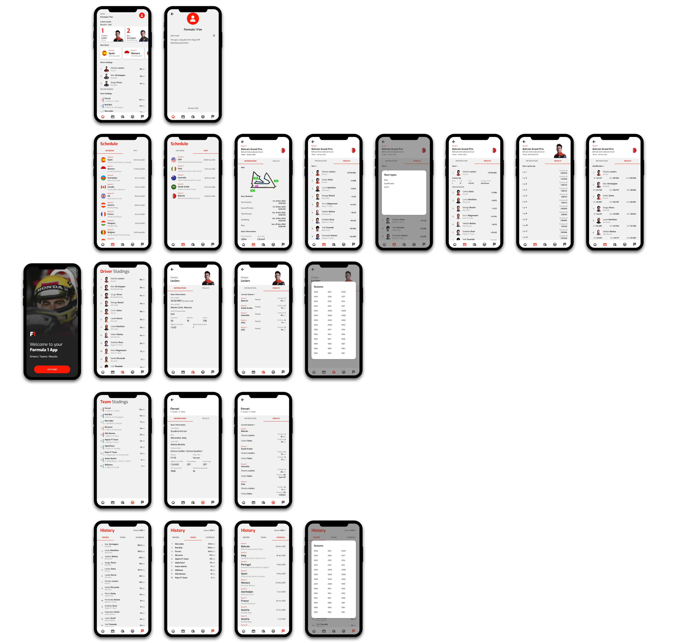

### Platforms

Android, iOS.

## Features:

* Xamarin.Forms 5.0.
* Xamarin Essentials
* Xamarin CommunityToolkit

### More information:

- Source code: [https://github.com/gheorghedarle/Xamarin-Formula1](https://github.com/gheorghedarle/Xamarin-Formula1)
- Author: [Darle Gheorghe](https://github.com/gheorghedarle)

## [Xamarin ToDo App](https://github.com/gheorghedarle/Xamarin-ToDoApp)

Todo App is a simple to do app developed with Xamarin and Firebase. The app allows you to create an account and login to create tasks and organize them into lists. You can see the tasks for the selected date in realtime mode, edit and delete them with swipe action, reorder them using drag and drop action and filter them by list from More screen. From Profile screen you can hide completed tasks on the main screen and see the total number of tasks, of completed tasks and lists that you created for your account. The app is available in both light and dark mode.

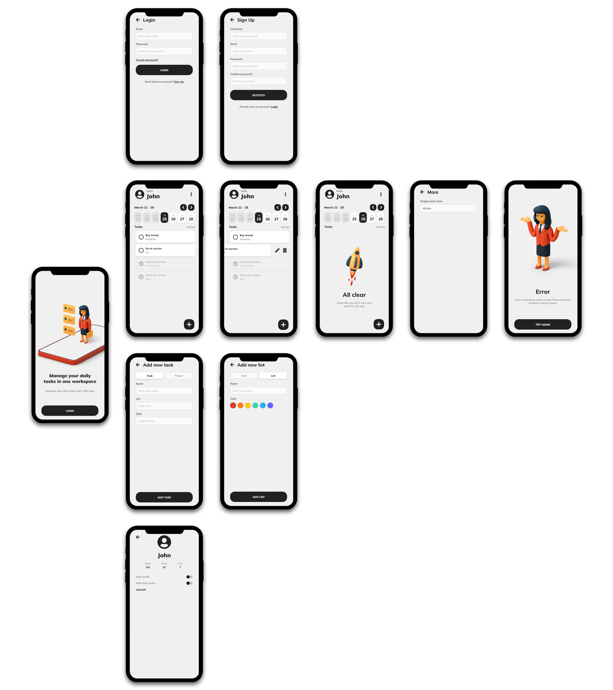

### Platforms

Android, iOS.

## Features: 

* Xamarin.Forms 5.0.
* MVVM (Prism).
* Xamarin CommunityToolkit
* Xamarin Firebase Auth (Firebase Authentication)
* Reactive UI (Realtime)
* Firebase Firestore (CRUD Operations)

### More information:
- Source code: [https://github.com/gheorghedarle/Xamarin-ToDoApp](https://github.com/gheorghedarle/Xamarin-ToDoApp)
- Author: [Darle Gheorghe](https://github.com/gheorghedarle) 

## [GamingStore](https://github.com/Altevir/xamarinforms-game-store)

Replicate design: https://www.uplabs.com/posts/game-store-ui-concept 

Features:
* Transition Effect (Fade) on title, description and background image.
* Added icons to indicate which platform(s) are supported by the game.
* Centered images on the Carousel.
* Display  the amount of trophies per game through using a Badge.

### Platforms

Android, iOS.

## Features: 

* Xamarin.Forms 5.0.
* Embedded Fonts.
* MVVM.

### More information:
- Source code: [https://github.com/Altevir/xamarinforms-game-store](https://github.com/Altevir/xamarinforms-game-store)
- Author: [Altevir](https://github.com/Altevir) 

## [ShapeAnimatedTransitions](https://github.com/FabriBertani/XFShapeAnimatedTransitions)

Cool transition animations with Shapes in Xamarin.Forms.

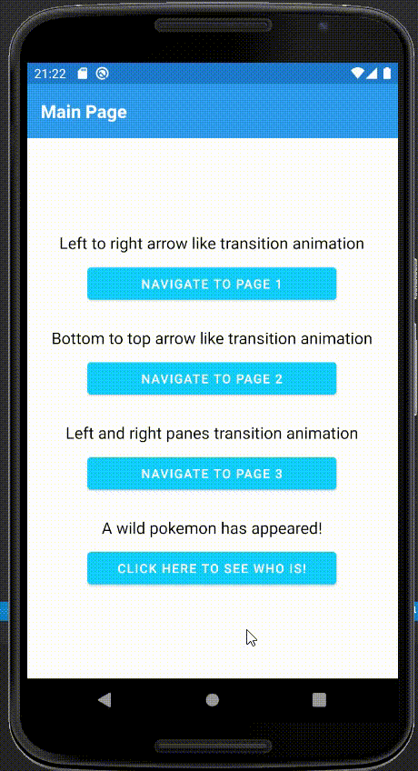  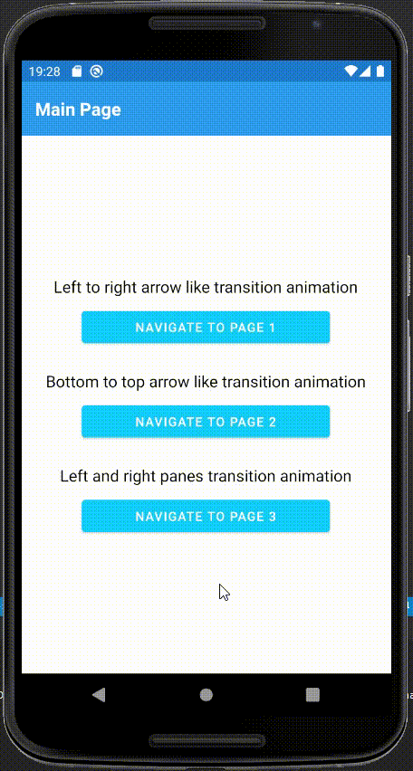 

### Platforms

Android, iOS.

## Features: 

* Animations
* Shapes

### More information:
- Source code: [https://github.com/FabriBertani/XFShapeAnimatedTransitions](https://github.com/FabriBertani/XFShapeAnimatedTransitions)
- Author: [Fabricio Bertani](https://github.com/FabriBertani) 

## [Fishing](https://github.com/kphillpotts/Fishing)

A Xamarin.Forms UI Challenge

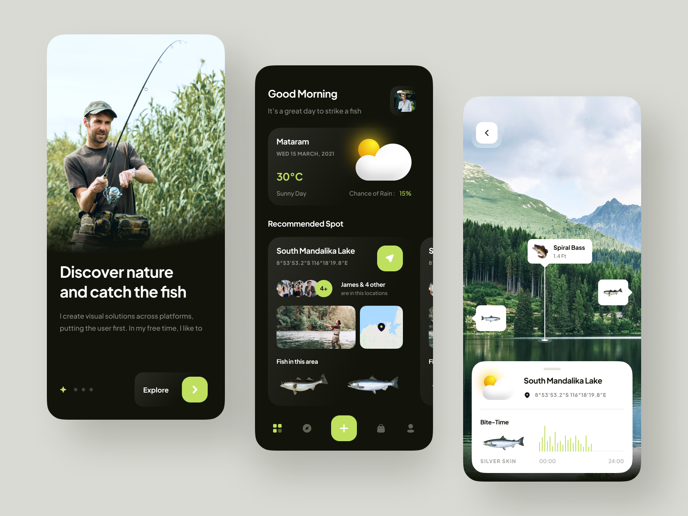 

Original Design: https://dribbble.com/shots/15278108-Fisherman-s-Fishing-Mobile-Apps

### Platforms

Android, iOS.

## Features: 

* CarouselView
* Custom Fonts
* Gradients
* Layouts

### More information:
- Source code: [https://github.com/kphillpotts/Fishing](https://github.com/kphillpotts/Fishing)
- Author: [Kym Phillpotts](https://github.com/kphillpotts) 
  
## [Facebook Mobile Login Clone](https://github.com/ShahrukhYousafzai/FacebookMobileAppLoginUIClone)

Clone of Facebook Login UI Design in Xamarin Forms

 

### Platforms

Android, iOS.

## Features: 

* Layouts

### More information:
- Source code: [https://github.com/ShahrukhYousafzai/FacebookMobileAppLoginUIClone](https://github.com/ShahrukhYousafzai/FacebookMobileAppLoginUIClone)
- Author: [Shahrukh Yousafzai](https://github.com/ShahrukhYousafzai) 

## [Uvento](https://github.com/Altevir/xamarinforms-uvento)

Replicating this [Dribbble](https://dribbble.com/shots/9519342-UVENTO-App-Event-app-Exploration) design in Xamarin.Forms.

 

### Platforms

Android, iOS.

## Features: 

* MVVM
* Embedded Fonts (https://docs.microsoft.com/en-us/xamarin/xamarin-forms/user-interface/text/fonts)
* CollectionView
* Xamarin.Forms 5.0
* Xamarin Community Toolkit

### More information:
- Source code: [https://github.com/Altevir/xamarinforms-uvento](https://github.com/Altevir/xamarinforms-uvento)
- Author: [Altevir](https://github.com/Altevir) 

## [MiniLauncher](https://github.com/mariusmuntean/MiniLauncher)

Apple Watch launcher recreated with pure Xamarin.Forms.

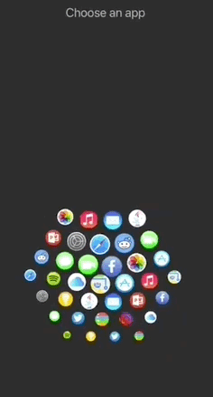 

### Platforms

Android, iOS.

## Features: 

- Animations!.
- Xamarin.Forms 5.

### More information:
- Source code: [https://github.com/mariusmuntean/MiniLauncher](https://github.com/mariusmuntean/MiniLauncher)
- Author: [Marius M.](https://github.com/mariusmuntean)

## [ChristmasShopping UI](https://github.com/LeomarisReyes/ChristmasShoppingUI)

UI replicated in Xamarin Forms.

⚠ Design obtained from Dribble. -> https://dribbble.com/shots/14814593-Chirstmas-Shopping-App

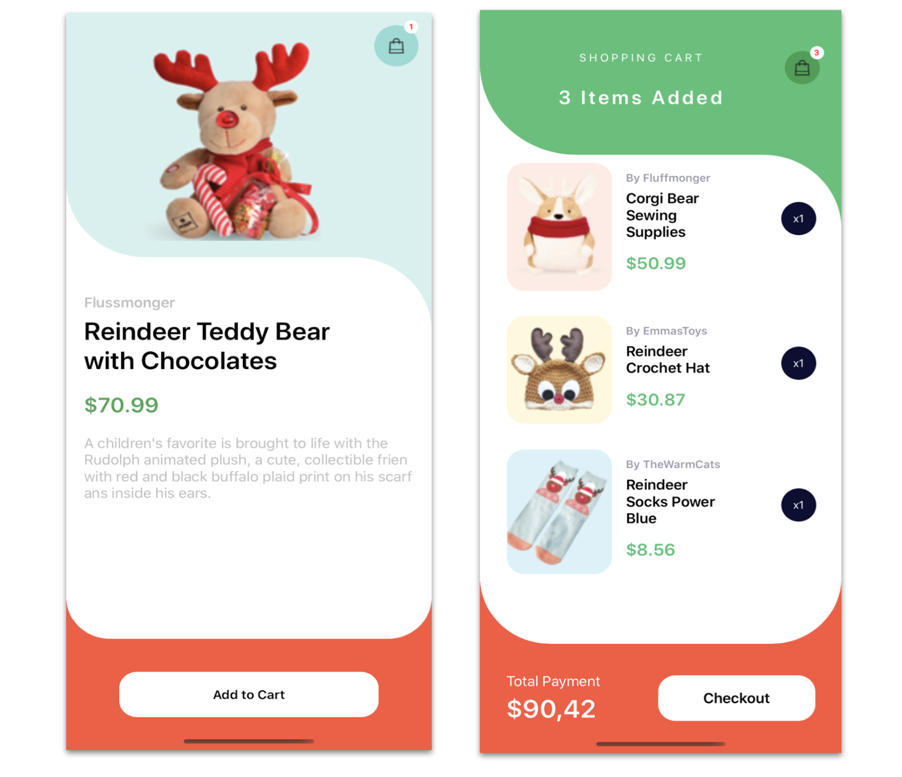 

### Platforms

Android, iOS.

## Features: 

- Layouts.
- PancakeView.

### More information:
- Blog: [Replicating Christmas Shopping UI in Xamarin Forms](https://askxammy.com/replicating-christmas-shopping-ui-in-xamarin-forms/)
- Source code: [https://github.com/LeomarisReyes/ChristmasShoppingUI](https://github.com/LeomarisReyes/ChristmasShoppingUI)
- Author: [Leomaris Reyes](https://github.com/LeomarisReyes)

## [BillDetail](https://github.com/LeomarisReyes/BillDetailSample)

UI replicated in Xamarin Forms.

⚠ Design obtained from Dribble. -> https://dribbble.com/shots/14274577/attachments/5925600?mode=media

 

### Platforms

Android, iOS.

## Features: 

- CollectionView.
- Layouts.
- PancakeView.

### More information:
- Blog: [Replicating Bill Details UI in Xamarin Forms](https://askxammy.com/replicating-bill-details-ui-in-xamarin-forms/)
- Source code: [https://github.com/LeomarisReyes/BillDetailSample](https://github.com/LeomarisReyes/BillDetailSample)
- Author: [Leomaris Reyes](https://github.com/LeomarisReyes)

## [Border Gradient Animation](https://github.com/devcrux/Border-Animation-in-Xamarin-Forms)

Border Gradient Animation in Xamarin Forms.

You can watch the video here 👉 https://youtu.be/bS0N6U-Ei78

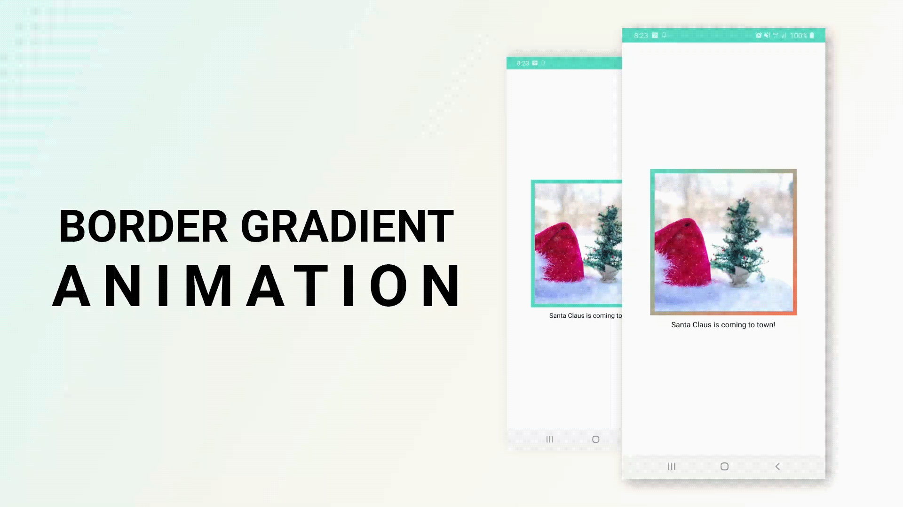 

### Platforms

Android, iOS.

## Features: 

- Brushes.
- Shapes.
  
### More information:
- Source code: [https://github.com/devcrux/Border-Animation-in-Xamarin-Forms](https://github.com/devcrux/Border-Animation-in-Xamarin-Forms)
- Author: [Oludayo Alli](https://github.com/devcrux)
  
## [Restaurant App](https://github.com/devcrux/Beautiful-Restaurant-App-in-Xamarin-Forms)

Building this beautiful Restaurant App in Xamarin Forms and spicing it up with some animations was made possible with Xamarin.Forms Shapes class and CarouselView.

You can watch the video here 👉 https://youtu.be/6gb_iRj_BYU

 

### Platforms

Android, iOS.

## Features: 

- Brushes.
- BindableLayout.
- CarouselView.
- Shapes.
  
### More information:
- Source code: [https://github.com/devcrux/Beautiful-Restaurant-App-in-Xamarin-Forms](https://github.com/devcrux/Beautiful-Restaurant-App-in-Xamarin-Forms)
- Author: [Oludayo Alli](https://github.com/devcrux)
  
## [Cakes Mobile App](https://github.com/shawyunz/XampleUI)

UI challenge in Xamarin.Forms. Original design from [Ghulam Rasool](https://dribbble.com/shots/14018398-Cakes-Mobile-App-UX-UI-Design/attachments/5634963?mode=media).

https://youtu.be/Lq7-2PzsSpY

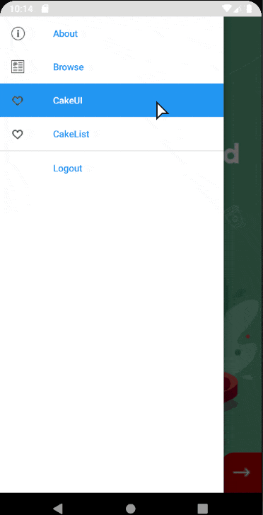 

### Platforms

Android, iOS.

## Features: 

- Shell.
- Navigation.
- SharedTransitions.
  
### More information:
- Source code: [https://github.com/shawyunz/XampleUI](https://github.com/shawyunz/XampleUI)
- Author: [Shaw Yu](https://github.com/shawyunz)
  
## [DevsDNA application](https://github.com/DevsDNA/DevsDNA-Application)

Open Source Xamarin.Forms application with the company lastest news, social networks, team members, etc.

 

### Platforms

Android, iOS.

## Features: 

The application has been developed with [**Xamarin Forms**](https://dotnet.microsoft.com/apps/xamarin/xamarin-forms), using controls like [CollectionView](https://docs.microsoft.com/xamarin/xamarin-forms/user-interface/collectionview/) or [CarouselView](https://docs.microsoft.com/xamarin/xamarin-forms/user-interface/carouselview/). Also, we use some community developed NuGet packages:
- [ReactiveUI](https://github.com/reactiveui/ReactiveUI)
- [Refit](https://github.com/reactiveui/refit)
- [Html Agility Pack](https://github.com/zzzprojects/html-agility-pack)
- [LottieXamarin](https://github.com/Baseflow/LottieXamarin)
- [Sharpnado.Shadows](https://github.com/roubachof/Sharpnado.Shadows)
- [Xamarin.Plugin.SharedTransitions](https://github.com/GiampaoloGabba/Xamarin.Plugin.SharedTransitions)
- [FFImageLoading](https://github.com/luberda-molinet/FFImageLoading)
- [Mobile.BuildTools](https://github.com/dansiegel/Mobile.BuildTools)

### More information:
- Source code: [https://github.com/DevsDNA/DevsDNA-Application](https://github.com/DevsDNA/DevsDNA-Application)
  
## [Sneakers UI](https://github.com/LeomarisReyes/SneakersUIApp)

Replicate a Sneaker UI App obtained from Dribble. You can check the design [here](https://dribbble.com/shots/13980919-Candy-Sneakers).

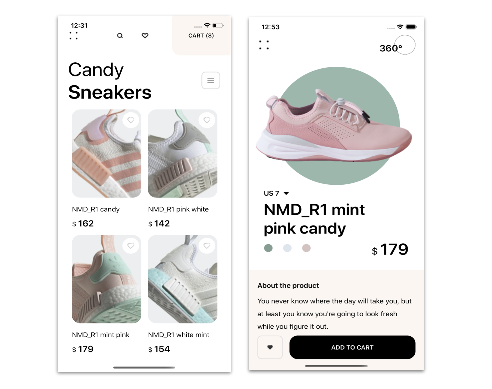

### Platforms

Android, iOS.

## Features: 

- CollectionView.
- Layouts.
- Navigation.
- PancakeView.

### More information:
- Blog: [Replicating Sneakers UI in Xamarin Forms](https://askxammy.com/replicating-sneakers-ui-in-xamarin-forms/)
- Source code: [https://github.com/LeomarisReyes/SneakersUIApp](https://github.com/LeomarisReyes/SneakersUIApp)
- Author: [Leomaris Reyes](https://github.com/LeomarisReyes)
  
## [Streaming UI](https://github.com/LeomarisReyes/StreamingUIApp)

Replicate a Streaming UI App obtained from Dribble. You can check the design [here](https://dribbble.com/shots/7015497-Streaming-App/attachments/18404?mode=media).

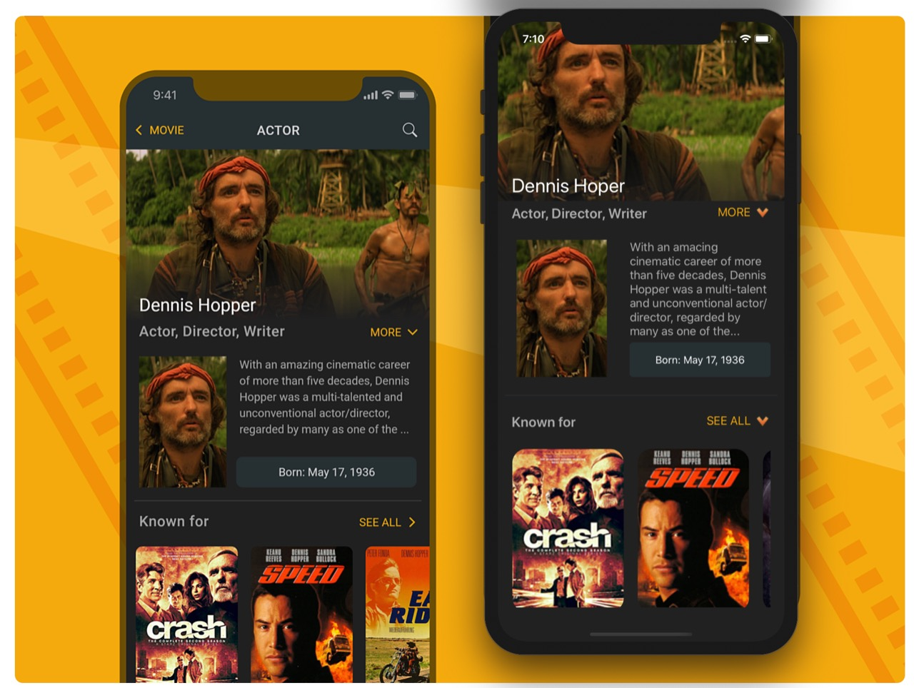

### Platforms

Android, iOS.

## Features: 

- CollectionView.
- Layouts.
- PancakeView.

### More information:
- Blog: [Replicating Streaming UI App in Xamarin Forms](https://askxammy.com/replicating-streaming-ui-app-in-xamarin-forms/)
- Source code: [https://github.com/LeomarisReyes/StreamingUIApp](https://github.com/LeomarisReyes/StreamingUIApp)
- Author: [Leomaris Reyes](https://github.com/LeomarisReyes)

## [Real Estate Property details UI](https://github.com/LeomarisReyes/RealStateUIApp)

Replicate a Real Estate UI obtained from Dribble. You can check the design [here](https://dribbble.com/shots/12997401-Real-Estate-app).

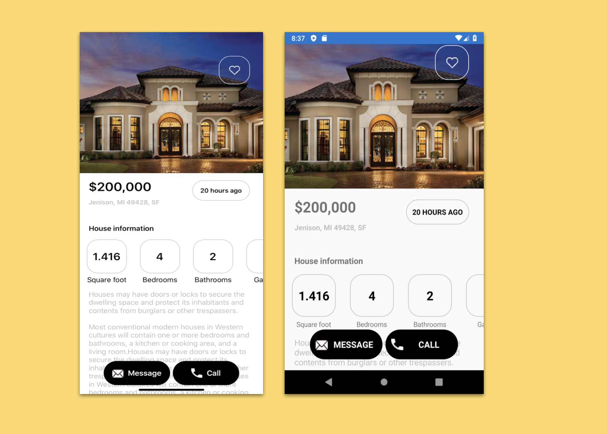

### Platforms

Android, iOS.

## Features: 

- CollectionView.
- Layouts.
- MVVM.

### More information:
- Blog: [Replicating Real Estate Property details UI in Xamarin Forms](https://askxammy.com/replicating-real-estate-property-details-ui-in-xamarin-forms/)
- Source code: [https://github.com/LeomarisReyes/RealStateUIApp](https://github.com/LeomarisReyes/RealStateUIApp)
- Author: [Leomaris Reyes](https://github.com/LeomarisReyes)

## [Raw Rows](https://github.com/AndreiMisiukevich/RawRows)

The "Raw Rows" is a sliding puzzle that consists of a frame of numbered square tiles in random order with one tile missing. The object of the puzzle is to place the tiles in order by making sliding moves that use the empty space.

Download:

* AppStore: https://apps.apple.com/zw/app/raw-rows/id1513966639
* Google Play: https://play.google.com/store/apps/details?id=com.sourcesoft.rawrows&hl=en

### Platforms

Android, iOS.

## Features: 

- PancakeView.
- TouchView.
- XForms.Plugin.AnimationNavigationPage
- Xamarin.Essentials.

### More information:
- Source code: [https://github.com/AndreiMisiukevich/RawRows](https://github.com/AndreiMisiukevich/RawRows)
- Author: [Andrei Misiukevich](https://twitter.com/andrik_just4fun)

## [Menu Transition](https://github.com/devcrux/Menu-Transition-in-Xamarin-Forms)

Seemless transition is an essential part of user experience design and this project implements a custom menu transition from a title view in Xamarin Forms.

You can watch the video here ➤ https://youtu.be/768kDDR-0BY

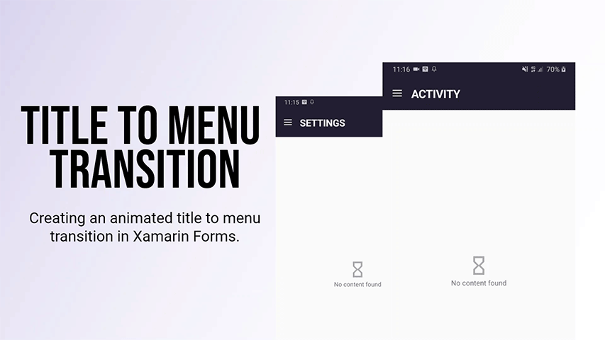

### Platforms

Android, iOS.

## Features: 

- Animations.
- BindableLayout.

### More information:
- Source code: [https://github.com/devcrux/Menu-Transition-in-Xamarin-Forms](https://github.com/devcrux/Menu-Transition-in-Xamarin-Forms)
- Author: [Oludayo Alli](https://github.com/devcrux)
  
## [AnimatedText](https://github.com/devcrux/Animated-Text-in-Xamarin-Forms)

Animations can add visual cues about what’s going on in your app and are especially useful when the state of your UI changes, such as when new content loads or new actions become available.

You can watch the video here ➤ https://youtu.be/ModuAWkv5K8

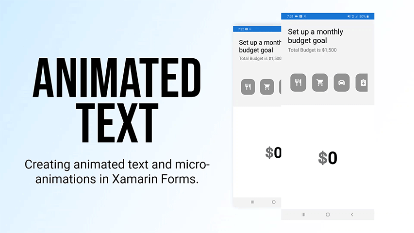

### Platforms

Android, iOS.

## Features: 

- Animations.
- BindableLayout.

### More information:
- Source code: [https://github.com/devcrux/Animated-Text-in-Xamarin-Forms](https://github.com/devcrux/Animated-Text-in-Xamarin-Forms)
- Author: [Oludayo Alli](https://github.com/devcrux)
  
## [AnimatedGradient](https://github.com/devcrux/Xamarin.Forms-Brushes-Animated-Gradient-Background)

Gradients have positive influence in modern designs. Xamarin.Forms 4.8 introduced the Xamarin.Forms Brushes that contain LinearGradientBrush, RadialGradientBrush and SolidColorBrush.

You can watch the video here ➤ https://youtu.be/ejDwwc1Iq1s

### Platforms

Android, iOS.

## Features: 

- Brushes.

### More information:
- Source code: [https://github.com/devcrux/Xamarin.Forms-Brushes-Animated-Gradient-Background](https://github.com/devcrux/Xamarin.Forms-Brushes-Animated-Gradient-Background)
- Author: [Oludayo Alli](https://github.com/devcrux)
 
## [Cinema App](https://github.com/devcrux/Cinema-App-Using-SkiaSharp-and-Xamarin-Fomrs-Shapes)

Ever wondered how to replicate the cinema seats arrangements in Xamarin.Forms?

You can watch the video here ➤ https://youtu.be/j_nVou7lNz0

### Platforms

Android, iOS.

## Features: 

- SkiaSharp.
- Shapes.

### More information:
- Source code: [https://github.com/devcrux/Cinema-App-Using-SkiaSharp-and-Xamarin-Fomrs-Shapes](https://github.com/devcrux/Cinema-App-Using-SkiaSharp-and-Xamarin-Fomrs-Shapes)
- Author: [Oludayo Alli](https://github.com/devcrux)
  
## [Furniture App](https://github.com/Altevir/xamarinforms-furniture)

App concept developed with Xamarin.Forms.

### Platforms

Android, iOS.

## Features: 
- MVVM 
- [PancakeView](https://github.com/sthewissen/Xamarin.Forms.PancakeView) 
- CollectionView
- Embedded Fonts
- Shapes

### More information:
- Source code: [https://github.com/Altevir/xamarinforms-furniture](https://github.com/Altevir/xamarinforms-furniture)
- Author: [Altevir](https://github.com/Altevir)

## [WatchShop](https://github.com/devcrux/Xamarin.Forms-Path---Watch-Shop)

The Clip property of controls in Xamarin.Forms allows you to change the shape of your control. We will explore the use of this property as we design a Watch Shop Ecommerce App in Xamarin Forms.

You can watch the video here ➤ https://youtu.be/pb-2bXWhuMo

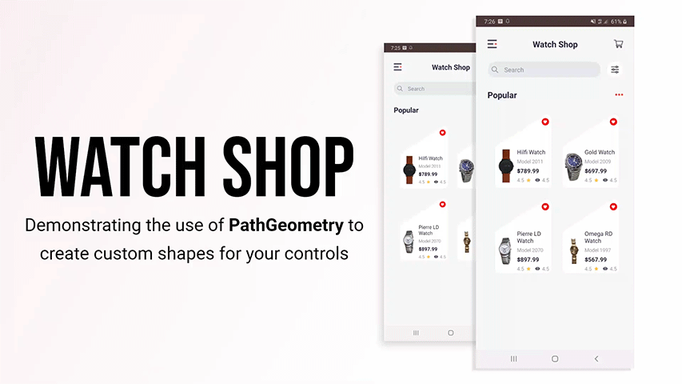

### Platforms

Android, iOS.

## Features: 

- [SharedTransitions](https://github.com/GiampaoloGabba/Xamarin.Plugin.SharedTransitions).
- Shapes.

### More information:
- Source code: [https://github.com/devcrux/Xamarin.Forms-Path---Watch-Shop](https://github.com/devcrux/Xamarin.Forms-Path---Watch-Shop)
- Author: [Oludayo Alli](https://github.com/devcrux)

## [DarkStore](https://github.com/ufukhawk/DarkStore)

Xamarin Forms Dark Store UI Design.

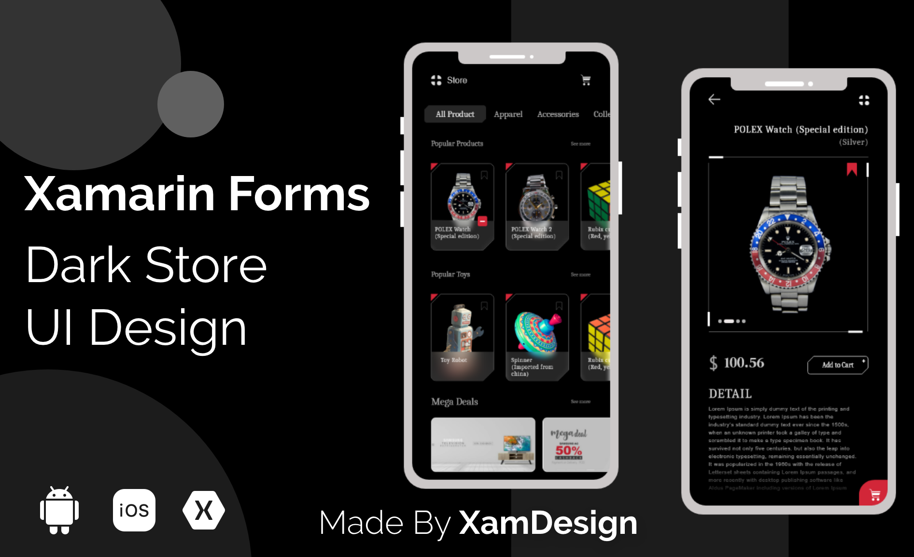

### Platforms

Android, iOS.

### Features:
* CollectionView.
* BindableLayouts.
* MVVM.
* Shapes.

### More information:
- Source code: [https://github.com/ufukhawk/DarkStore](https://github.com/ufukhawk/DarkStore)
- Author: [Ufuk Zimmerman](https://github.com/ufukhawk)

## [Delivery](https://github.com/Altevir/xamarinforms-delivery)

Xamarin.Forms App.

### Platforms

Android, iOS.

## Features: 
- MVVM 
- [PancakeView](https://github.com/sthewissen/Xamarin.Forms.PancakeView) 
- [Embedded Fonts](https://docs.microsoft.com/en-us/xamarin/xamarin-forms/user-interface/text/fonts) 
- CollectionView
- Shapes

### More information:
- Source code: [https://github.com/Altevir/xamarinforms-delivery](https://github.com/Altevir/xamarinforms-delivery)
- Author: [Altevir](https://github.com/Altevir)

## [Kidzee Games](https://github.com/Altevir/xamarinforms-kidzee-games)

Xamarin.Forms App.

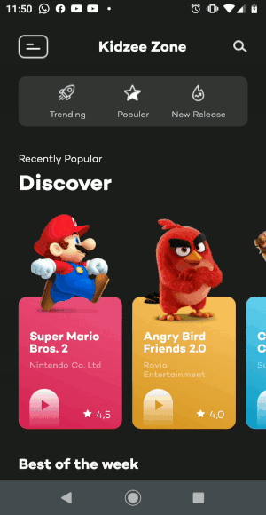

### Platforms

Android, iOS.

## Features: 
- MVVM 
- [PancakeView](https://github.com/sthewissen/Xamarin.Forms.PancakeView) 
- [Embedded Fonts](https://docs.microsoft.com/en-us/xamarin/xamarin-forms/user-interface/text/fonts) 
- CollectionView

### More information:
- Source code: [https://github.com/Altevir/xamarinforms-kidzee-games](https://github.com/Altevir/xamarinforms-kidzee-games)
- Author: [Altevir](https://github.com/Altevir)

## [Art Store](https://github.com/Altevir/xamarinforms-art-store)

Xamarin.Forms App.

### Platforms

Android, iOS.

## Features: 
- MVVM 
- [PancakeView](https://github.com/sthewissen/Xamarin.Forms.PancakeView) 
- [Embedded Fonts](https://docs.microsoft.com/en-us/xamarin/xamarin-forms/user-interface/text/fonts) 
- VisualStateManager
- CollectionView

### More information:
- Source code: [https://github.com/Altevir/xamarinforms-art-store](https://github.com/Altevir/xamarinforms-art-store)
- Author: [Altevir](https://github.com/Altevir)

## [E-commerce Liquors](https://github.com/Altevir/xamarinforms-ecommerce-liquors)

Xamarin.Forms App.

 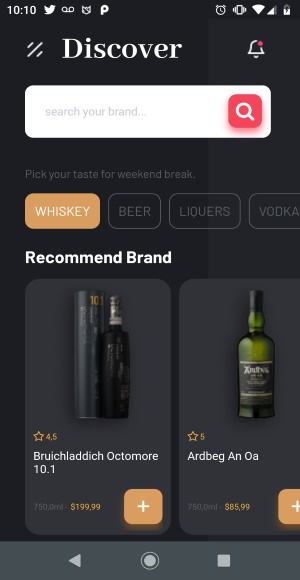

### Platforms

Android, iOS.

## Features: 
- MVVM 
- [PancakeView](https://github.com/sthewissen/Xamarin.Forms.PancakeView) 
- [Sharpnado.Shadows](https://github.com/roubachof/Sharpnado.Shadows)
- [Embedded Fonts](https://docs.microsoft.com/en-us/xamarin/xamarin-forms/user-interface/text/fonts) 
- CollectionView

### More information:
- Source code: [https://github.com/Altevir/xamarinforms-ecommerce-liquors](https://github.com/Altevir/xamarinforms-ecommerce-liquors)
- Author: [Altevir](https://github.com/Altevir)

## [CalendarUI](https://github.com/LeomarisReyes/CalendarUI)

 Replicate a Calendar / Schedule UI obtained from Dribble. You can check the design  [here](https://dribbble.com/shots/12082951-FODMAP/attachments/3714005?mode=media)!

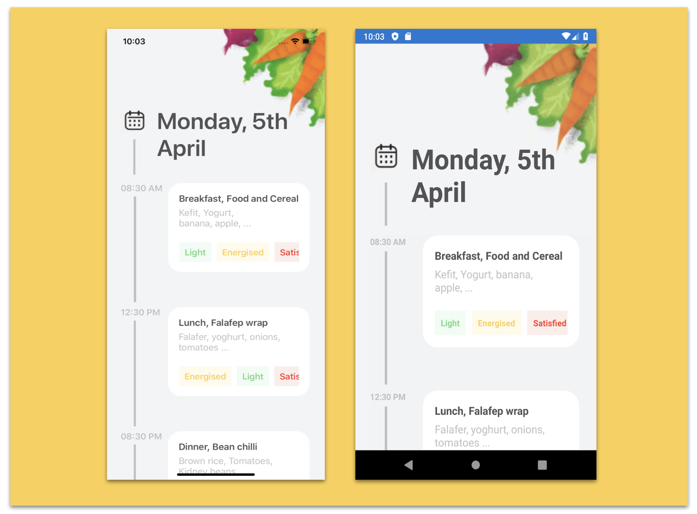

### Platforms

Android, iOS.

## Features: 

- CollectionView.
- Layouts.

### More information:
- Blog: [Replicating Schedule UI in Xamarin Forms](https://askxammy.com/replicating-schedule-ui-in-xamarin-forms/)
- Source code: [https://github.com/LeomarisReyes/CalendarUI](https://github.com/LeomarisReyes/CalendarUI)
- Author: [Leomaris Reyes](https://github.com/LeomarisReyes)

## [LoginPage](https://github.com/devcrux/Xamarin.Forms-Shapes)

Making use of the Xamarin.Forms Shapes and Xamarin.Forms MediaElement to create an elegant login page in xamarin forms.

You can watch the video here ➤ https://youtu.be/X3ZND30zI_A

### Platforms

Android, iOS.

## Features: 

- MediaElement.
- Shapes.

### More information:
- Source code: [https://github.com/devcrux/Xamarin.Forms-Shapes](https://github.com/devcrux/Xamarin.Forms-Shapes)
- Author: [Oludayo Alli](https://github.com/devcrux)

## [EventTracker](https://github.com/devcrux/Animated-Xamarin.Forms-Expander)

Let's make use of the Xamarin.Forms Expander to create an animated expandable list in Xamarin Forms.

You can watch the video here ➤ https://youtu.be/ndF5we5_Ijw

### Platforms

Android, iOS.

## Features: 

- Animations.
- Expander.

### More information:
- Source code: [https://github.com/devcrux/Animated-Xamarin.Forms-Expander](https://github.com/devcrux/Animated-Xamarin.Forms-Expander)
- Author: [Oludayo Alli](https://github.com/devcrux)

## [E-commerce HeadPhones App](https://github.com/Altevir/xamarinforms-ecommerce-headphones)

App concept developed with Xamarin.Forms. Design: https://www.uplabs.com/posts/ecommerce-app-ui-concept 

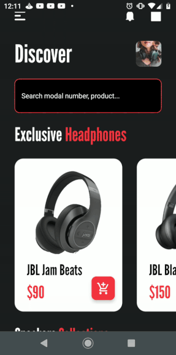

### Platforms

Android, iOS.

## Features: 
- [Animations](https://docs.microsoft.com/en-us/xamarin/xamarin-forms/user-interface/animation/simple).
- CollectionView.
- [PancakeView](https://github.com/sthewissen/Xamarin.Forms.PancakeView).

### More information:
- Source code: [https://github.com/Altevir/xamarinforms-ecommerce-headphones](https://github.com/Altevir/xamarinforms-ecommerce-headphones)
- Author: [Altevir](https://github.com/Altevir)

## [iBakePancakes](https://github.com/sthewissen/iBakePancakes)

A fancy UI sample for an app providing pancake recipes, based on: https://dribbble.com/shots/4476011-Cook-Book-App-Design.

### Platforms

Android, iOS.

## Features: 
- [FFImageLoading](https://github.com/luberda-molinet/FFImageLoading) (Svg).
- [PancakeView](https://github.com/sthewissen/Xamarin.Forms.PancakeView).
- [Sharpnado.MaterialFrame](https://github.com/roubachof/Sharpnado.MaterialFrame).

### More information:
- Source code: [https://github.com/sthewissen/iBakePancakes](https://github.com/sthewissen/iBakePancakes)
- Author: [Steven Thewissen](https://twitter.com/devnl)

## [SwipeMenu](https://github.com/devcrux/Xamarin.Forms-SwipeView)

Creating a custom side menu in Xamarin.Forms using Swipe View.

You can watch the video here ➤ https://www.youtube.com/watch?v=1Vs4T6pEi_

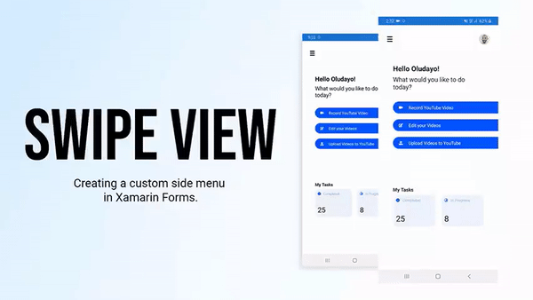

### Platforms

Android, iOS.

## Features: 
- Animations.
- SwipeView.

### More information:
- Source code: [https://github.com/devcrux/Xamarin.Forms-SwipeView](https://github.com/devcrux/Xamarin.Forms-SwipeView)
- Author: [Oludayo Alli](https://github.com/devcrux)

## [XamNike](https://github.com/dgokhan/XamNike)

Replicate [Uplabs Nike App design](https://dribbble.com/shots/9009192-Uplabs-Nike-app-redesign-free-UI-kit) in Xamarin.Forms.

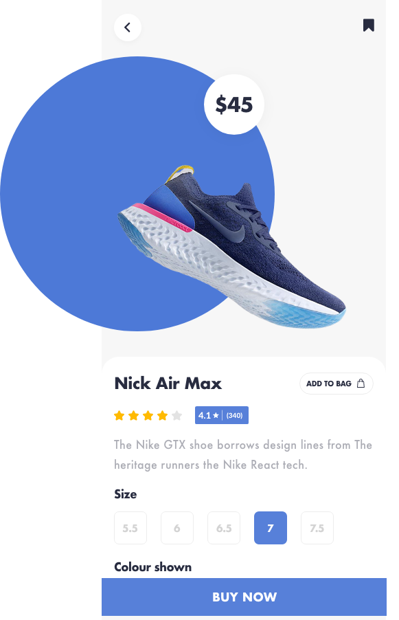

### Platforms

Android, iOS.

## Features: 
- [FFImageLoading](https://github.com/luberda-molinet/FFImageLoading) by [Daniel Luberda](https://github.com/daniel-luberda)
- Layouts.

### More information:
- Blog: [Xamarin.Forms – XamNike UI](https://www.gokhandogru.net/xamarin-forms-xamnike-ui/)
- Source code: [https://github.com/dgokhan/XamNike](https://github.com/dgokhan/XamNike)
- Author: [Gökhan Doğru](https://github.com/dgokhan)

## [TravelApp](https://github.com/devcrux/Flip-Animation-in-Xamarin.Forms)

Implement a Flip Animation in Xamarin.Forms.

You can watch the video here ➤ https://youtu.be/VSNFLBGJEXs

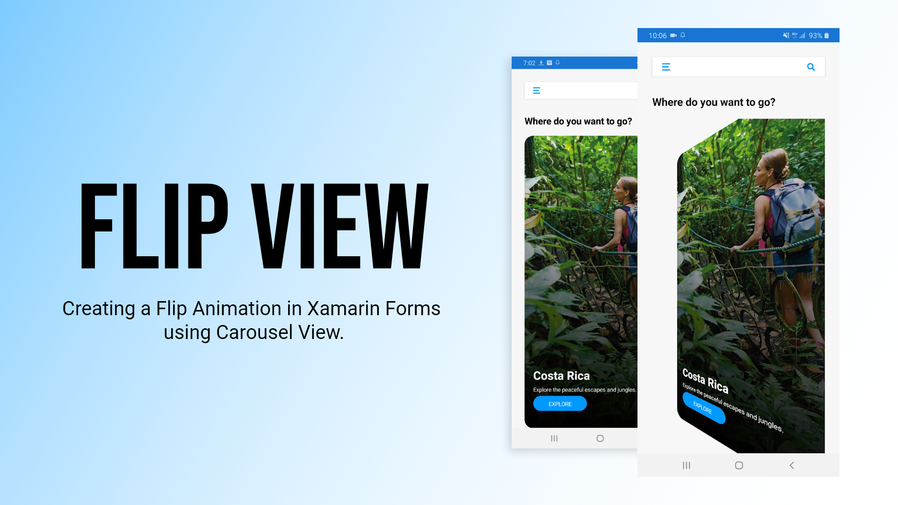

### Platforms

Android, iOS.

## Features: 
- Animations

### More information:
- Source code: [https://github.com/devcrux/Flip-Animation-in-Xamarin.Forms](https://github.com/devcrux/Flip-Animation-in-Xamarin.Forms)
- Author: [Oludayo Alli](https://github.com/devcrux)

## [AgendaApp](https://github.com/devcrux/Xamarin.Forms-Expander)

Let’s make use of the Xamarin.Forms Expander to create and expandable list in Xamarin Forms.

Creating an expandable list in Xamarin Forms use to be tricky but now with the new Expander in Xamarin Forms, it is quite easy.

You can watch the video here ➤ https://youtu.be/rT3LwzSsMmo

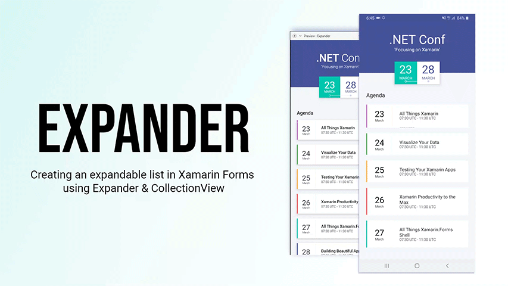

### Platforms

Android, iOS.

## Features: 
- Expander
- [PancakeView](https://github.com/sthewissen/Xamarin.Forms.PancakeView).
  
### More information:
- Source code: [https://github.com/devcrux/Xamarin.Forms-Expander](https://github.com/devcrux/Xamarin.Forms-Expander)
- Author: [Oludayo Alli](https://github.com/devcrux)

## [FlightUISample](https://github.com/LeomarisReyes/FlightUISample)

Replicate a Flight UI obtained from Dribbble ([Gleb Kuznetsov](https://dribbble.com/glebich)✈) using Xamarin.Forms.

### Platforms

Android, iOS.

## Features: 
- CollectionView.
- [PancakeView](https://github.com/sthewissen/Xamarin.Forms.PancakeView).

### More information:
- Blog: [Replicating Flight UI](https://askxammy.com/part-1-replicating-flight-ui-preparing-the-project-to-work-with-mvvm/)
- Source code: [https://github.com/LeomarisReyes/FlightUISample](https://github.com/LeomarisReyes/FlightUISample)
- Author: [Leomaris Reyes](https://github.com/LeomarisReyes)

## [Coffeeffee](https://github.com/sthewissen/Coffeeffee)

Implementation of a [coffee shopping UI](https://dribbble.com/shots/11246934-Product-Page-Ui-Exploration/attachments/2854822?mode=media) using Xamarin.Forms.

### Platforms

Android, iOS.

## Features: 
- CarouselView.
- Custom Fonts.
- SkiaSharp.

### More information:
- Source code: [https://github.com/sthewissen/Coffeeffee](https://github.com/sthewissen/Coffeeffee)
- Author: [Steven Thewissen](https://twitter.com/devnl)

## [Play Video in Xamarin.Forms](https://github.com/devcrux/Play-Video-in-Xamarin-Forms)

Learn how to design a COMPLETE Video Player in Xamarin Forms. 

You can watch the video here ➤ https://youtu.be/mLJe5yxq_7o

### Platforms

Android, iOS.

## Features: 
- [PancakeView](https://github.com/sthewissen/Xamarin.Forms.PancakeView).
- [Plugin.MediaManager.Forms](https://github.com/Baseflow/XamarinMediaManager).
  
### More information:
- Source code: [https://github.com/devcrux/Play-Video-in-Xamarin-Forms](https://github.com/devcrux/Play-Video-in-Xamarin-Forms)
- Author: [Oludayo Alli](https://github.com/devcrux)
  
## [Play Audio in Xamarin.Forms](https://github.com/devcrux/Play-Audio-in-Xamarin-Forms)

Learn how to design a COMPLETE Music Player in Xamarin Forms. In this video, we will make use of the Media Manager Plugin to make a music player app in Xamarin Forms and at the end you will see that music player in xamarin forms in quite easy.

You can watch the video here ➤ https://youtu.be/7plenjrcloM

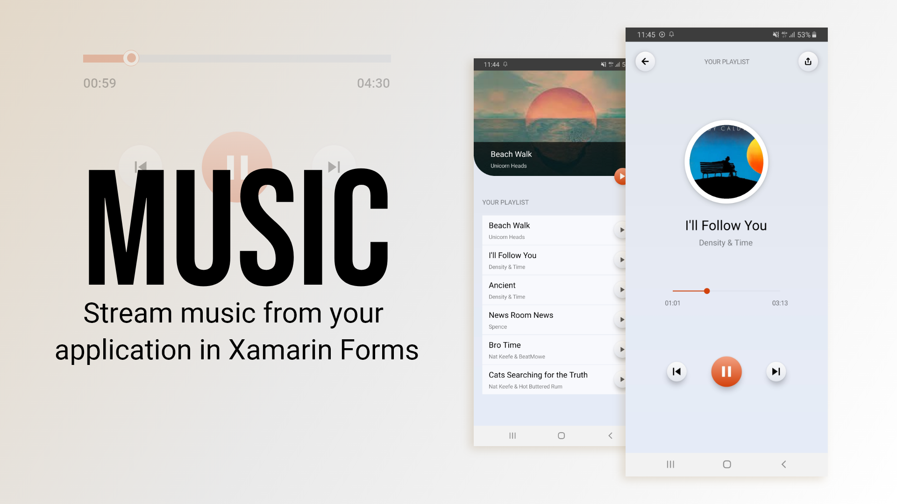

### Platforms

Android, iOS.

## Features: 
- [PancakeView](https://github.com/sthewissen/Xamarin.Forms.PancakeView).
- [Plugin.MediaManager.Forms](https://github.com/Baseflow/XamarinMediaManager).

### More information:
- Source code: [https://github.com/devcrux/Play-Audio-in-Xamarin-Forms](https://github.com/devcrux/Play-Audio-in-Xamarin-Forms)
- Author: [Oludayo Alli](https://github.com/devcrux)

## [Xamarin.Forms Wallet CreditCard](https://github.com/Altevir/xamarinforms-wallet-creditcard)

Xamarin.Forms Wallet CreditCard.

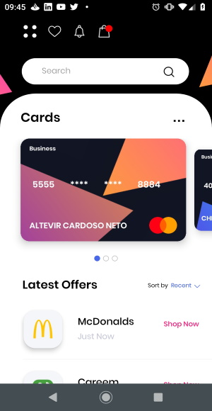 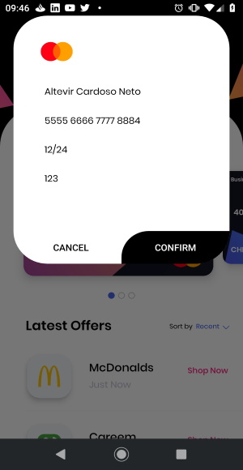

### Platforms

Android, iOS.

## Features: 
- [CardsView](https://github.com/AndreiMisiukevich/CardView).
- CollectionView.
- Fonts Embedded.
- MVVM.
- [PancakeView](https://github.com/sthewissen/Xamarin.Forms.PancakeView).
- [Rg.Plugins.PopUp](https://github.com/rotorgames/Rg.Plugins.Popup).

### More information:
- Source code: [https://github.com/Altevir/xamarinforms-wallet-creditcard](https://github.com/Altevir/xamarinforms-wallet-creditcard)
- Author: [Altevir](https://github.com/Altevir)

## [Nomadic](https://github.com/Elisha-Misoi/Nomadic) 

[Microsoft News](https://play.google.com/store/apps/details?id=com.microsoft.amp.apps.bingnews&hl=en) is built with Xamarin. I wondered… can I build the same 🤔? So I set out on this journey, I called it Nomadic.

### Platforms

Android, iOS.

## Features: 
- [Xamarin.Essentials](https://github.com/xamarin/Essentials) by Microsoft
- [NewsAPI C# Client](https://newsapi.org/docs/client-libraries/csharp) by [newsapi.org](https://newsapi.org/)
- [Xamarin.Auth](https://github.com/xamarin/Xamarin.Auth)
- [Plugin.FirebaseAuth](https://github.com/f-miyu/Plugin.FirebaseAuth) by [f-miyu](https://github.com/f-miyu)
- [Plugin.CloudFirestore](https://github.com/f-miyu/Plugin.CloudFirestore) by [f-miyu](https://github.com/f-miyu)
- [UserDialogs](https://github.com/aritchie/userdialogs) by [Allan Ritchie](https://allancritchie.net/)
- [PancakeView](https://github.com/sthewissen/Xamarin.Forms.PancakeView) by [Steven Thewissen](https://thewissen.io)
- [CardsView](https://github.com/AndreiMisiukevich/CardView) by [Andrei Misiukevich](https://github.com/AndreiMisiukevich)
- [FFImageLoading](https://github.com/luberda-molinet/FFImageLoading) by [Daniel Luberda](https://github.com/daniel-luberda)
- [Rg.Plugins.Popup](https://github.com/rotorgames/Rg.Plugins.Popup) by [Martijn van Dijk](https://github.com/martijn00)
- [CurrentActivityPlugin](https://github.com/jamesmontemagno/CurrentActivityPlugin) by [James Montemagno](https://github.com/jamesmontemagno)

### Blog posts:
- [Part 1:](https://link.medium.com/RF1k3lBN15) Setting Up
- [Part 2:](https://link.medium.com/Hfp1tLHN15) Using Shell
- [Part 3:](https://link.medium.com/82PjSwTN15) Using Custom Fonts
- [Part 4:](https://link.medium.com/bpzxOmZN15) Using Themes
- [Part 5:](https://link.medium.com/TbZ9nodO15) NewsAPI
- [Part 6:](https://link.medium.com/R4RPUTkO15) Using MVVM
- [Part 7:](https://link.medium.com/RRWaHIwO15) Using CarouselView
- [Part 8:](https://link.medium.com/UYqcSsFO15) Using ListView with DataTemplateSelector
- [Part 9:](https://link.medium.com/1loOkgLO15) Using WebView
- [Part 10:](https://link.medium.com/E5mdpESO15) Using CollectionView
- [Part 11:](https://link.medium.com/pYQD37XO15) Using Geo Location
- [Part 12:](https://link.medium.com/Z7A83o3O15) Creating a Firebase Project
- [Part 13:](https://link.medium.com/UsQv6t9O15) Google Authentication with Firebase
- [Part 14:](https://link.medium.com/hCSlA6dP15) Using Xamarin.Essentials Preferences and SecureStorage .....aand Wrapping Up 🙃
  
### More information:
- Source code: [https://github.com/Elisha-Misoi/Nomadic](https://github.com/Elisha-Misoi/Nomadic)
- Author: [Elisha Misoi](https://github.com/Elisha-Misoi)

## [AlarmApp](https://github.com/devcrux/Clock-Animation-in-Xamarin-Forms)

In this Xamarin Forms Tutorial we will be looking at creating Clock Animation in Xamarin Forms. We will be making use of the SkiaSharp 2D Drawing engine to create a beautiful clock and alarm design.

You can watch the video here ➤ https://youtu.be/JbpDyRfaOqM

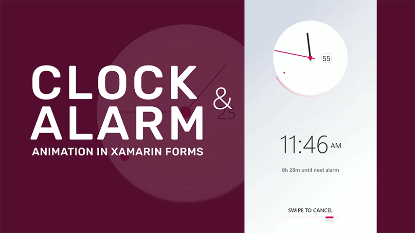

### Platforms

Android, iOS.

## Features: 
* SkiaSharp.
* PancakeView.
* Xamarin.Essentials.

### More information:
- Source code: [https://github.com/devcrux/Clock-Animation-in-Xamarin-Forms](https://github.com/devcrux/Clock-Animation-in-Xamarin-Forms)
- Author: [Oludayo Alli](https://github.com/devcrux)
  
## [Burger Shop App](https://github.com/devcrux/CollectionView-and-CarouselView-in-Xamarin-Forms)

Xamarin Forms has awesome tools and controls to create modern user interface suc as Collection View & Carousel View.

This is the source code of a video, where you will learn the process of creating a Burger Shop App in Xamarin Forms using Collection View, Carousel View & the MVVM architectural pattern.

You can watch the video here ➤ https://youtu.be/mbqzKf7HVcQ

### Platforms

Android, iOS.

## Features: 
* CarouselView.
* CollectionView.

### More information:
- Source code: [https://github.com/devcrux/CollectionView-and-CarouselView-in-Xamarin-Forms](https://github.com/devcrux/CollectionView-and-CarouselView-in-Xamarin-Forms)
- Author: [Oludayo Alli](https://github.com/devcrux)
  
## [PropertyApp](https://github.com/devcrux/Animation-In-Xamarin-forms)

The concept of animation in Xamarin Forms will be explained by designing a Real-Estate Property App, where I also explained how to work with embedded fonts, gradients, custom renderers and visual state manager.

You can watch the video here ➤ https://youtu.be/WDw9R8seqMo

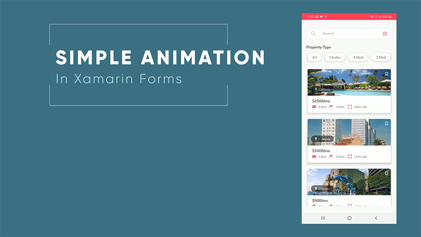

### Platforms

Android, iOS.

## Features: 
* Embeded Fonts.
* Gradients.
* Animations.
* VisualState.

### More information:
- Source code: [https://github.com/devcrux/Animation-In-Xamarin-forms](https://github.com/devcrux/Animation-In-Xamarin-forms)
- Author: [Oludayo Alli](https://github.com/devcrux)
  
## [Free Chat](https://github.com/DamienDoumer/freechat)

This is a sample Xamarin.Forms application demonstrating how to build a user interface for a chat app. Inspired by https://dribbble.com/shots/10446738-Direct-messaging-mobile-app-design.

### Platforms

Android, iOS.

## Features: 
* Shell.
* CollectionView.
* Lottie.
* PancakeView.
* XamEffects.
* Xamarin.Essentials.

### More information:
- Source code: [https://github.com/DamienDoumer/freechat](https://github.com/DamienDoumer/freechat)
- Author: [Damien Doumer](https://github.com/DamienDoumer)

## [EcommerceXF](https://github.com/exendahal/ecommerceXF)

Ecommerce design with Xamarin Forms. Design based on https://www.uistore.design/items/shopping-ui-kit-for-adobe-xd/.

### Platforms

Android, iOS.

## Features: 
* CollectionView.
* SwipeView.

### More information:
- Source code: [https://github.com/exendahal/ecommerceXF](https://github.com/exendahal/ecommerceXF)
- Author: [Santosh Dahal](https://github.com/exendahal)

## [MbongoUIApp](https://github.com/Amaro96/Amaro96-MbongoUIApp)

Mbongo means Money translating into Portuguese. Developed with the intention of practice and increasing productivity creating screens with Xamarin.Forms.

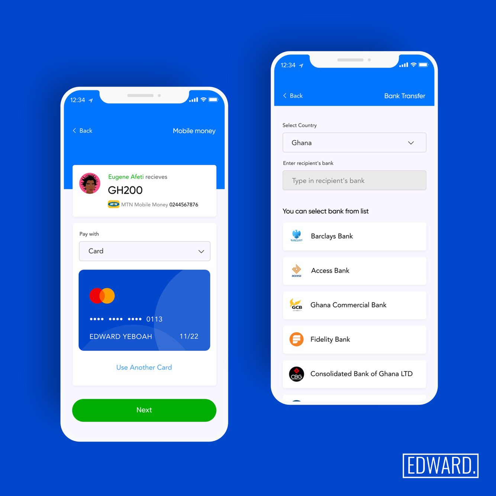

### Platforms

Android, iOS.

## Features: 
* CircleImage.
* MVVM.
* PancakeView.
* Xamarin.Essentials.

### More information:
- Source code: [https://github.com/Amaro96/Amaro96-MbongoUIApp](https://github.com/Amaro96/Amaro96-MbongoUIApp)
- Author: [Amaro Manungu](https://github.com/Amaro96)
  
## [NeomorphismSmartHomeApp](https://github.com/felipebaltazar/NeomorphismSmartHomeApp)

Smart Home App UI by Amit kumar using Xamarin.Forms.NeoControls.

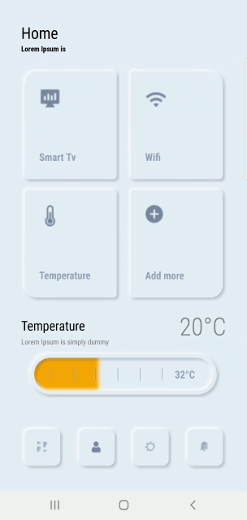 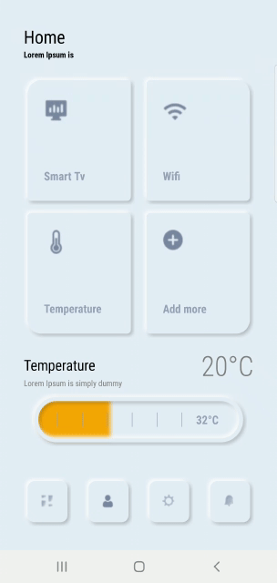 

### Platforms

Android, iOS.

## Features: 
* [Xamarin.Forms.NeoControls](https://github.com/felipebaltazar/Xamarin.Forms.NeoControls).

### More information:
- Source code: [https://github.com/felipebaltazar/NeomorphismSmartHomeApp](https://github.com/felipebaltazar/NeomorphismSmartHomeApp)
- Author: [Felipe Baltazar](https://github.com/felipebaltazar)

## [ShoppingList](https://github.com/jsuarezruiz/ShoppingList)

Xamarin.Forms goodlooking UI sample using the new Expander Control. Based on [Shopping List design](https://dribbble.com/shots/2340386-Shopping-List) by Hila Peleg.

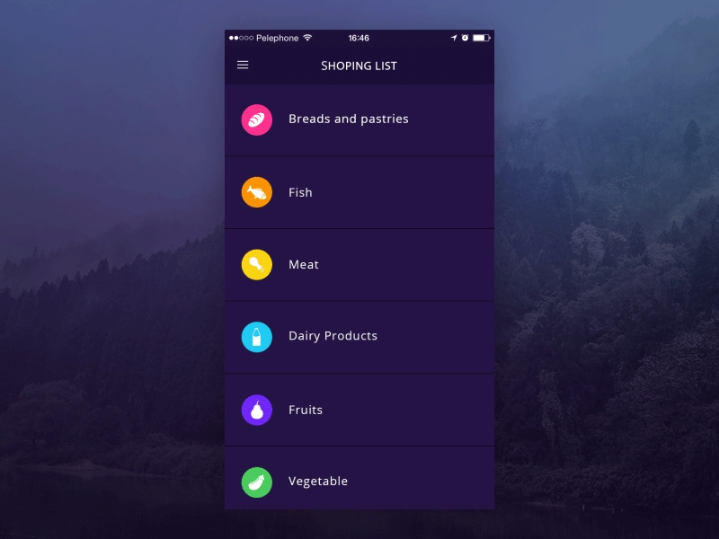 

### Platforms

Android, iOS.

## Features: 
* BindableLayout.
* Expander.
* Triggers.

### More information:
- Source code: [https://github.com/jsuarezruiz/ShoppingList](https://github.com/jsuarezruiz/ShoppingList)
- Author: [Javier Suárez](https://twitter.com/jsuarezruiz)

## [Xamarin.Forms Covid-19 Live](https://github.com/Altevir/xamarinforms-covid19)

Developed with the aim of tracking Covid-19 cases with data from affected countries.

 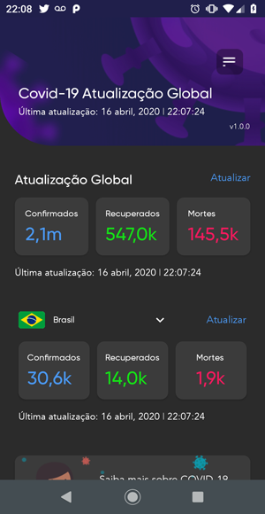

### Platforms

Android, iOS.

## Features: 
* [Flurl](https://flurl.dev/) 
* [PancakeView](https://github.com/sthewissen/Xamarin.Forms.PancakeView) 
* LiteDB 
* [Rg.Plugins.Popup](https://github.com/rotorgames/Rg.Plugins.Popup)
* [PluginMultilingual](https://github.com/CrossGeeks/MultilingualPlugin) 
* [Skeleton](https://github.com/HorusSoftwareUY/Xamarin.Forms.Skeleton) 
* [FFImageLoading](https://github.com/luberda-molinet/FFImageLoading)
* Xamarin.Essentials

### More information:
- Source code: [https://github.com/Altevir/xamarinforms-covid19](https://github.com/Altevir/xamarinforms-covid19)
- Author: [Altevir](https://github.com/Altevir)

## [Photostock](https://github.com/ufukhawk/XamarinForms-PhotoStock-UI-Design)

Xamarin.Forms PhotoStock UI design.

### Platforms

Android, iOS.

### Features:
* Animations.
* FlowListView.
* PancakeView.
* Shared Transitions.

### More information:
- Source code: [https://github.com/ufukhawk/XamarinForms-PhotoStock-UI-Design](https://github.com/ufukhawk/XamarinForms-PhotoStock-UI-Design)
- Author: [Ufuk Zimmerman](https://github.com/ufukhawk)

## [TurnipTracker](https://github.com/jamesmontemagno/app-ac-islandtracker)

Animal Crossing Turnip Tracking Mobile App.

### Platforms

Android, iOS.

### Features:
* Custom Fonts.
* [PancakeView](https://github.com/sthewissen/Xamarin.Forms.PancakeView).
* SwipeView.
* [Visual](https://docs.microsoft.com/en-us/xamarin/xamarin-forms/user-interface/visual/).

### More information:
- Source code: [https://github.com/jamesmontemagno/app-ac-islandtracker](https://github.com/jamesmontemagno/app-ac-islandtracker)
- Author: [James Montemagno](https://twitter.com/jamesmontemagno)

## [Covid19.Forms](https://github.com/AnthonyLatty/Covid19.Forms)

Xamarin.Forms Covid19 Tracker App

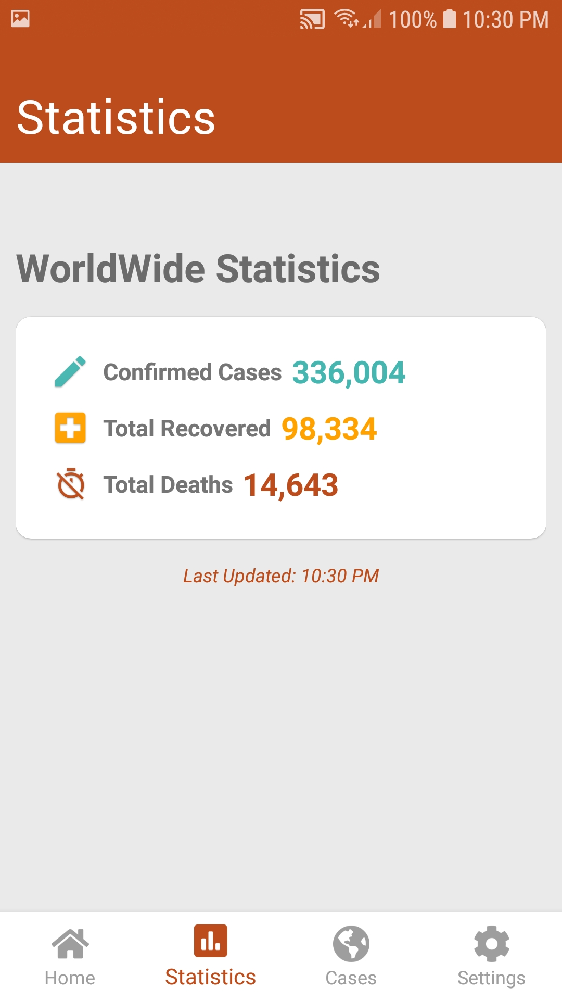 

### Platforms

Android, iOS.

### Features:
* [Acr.UserDialogs](https://github.com/aritchie/userdialogs)
* [Newtonsoft.Json](https://github.com/JamesNK/Newtonsoft.Json)
* [Corcav.Behaviors](https://github.com/corradocavalli/Corcav.Behaviors)
* [Xamarin.Essentials](https://docs.microsoft.com/xamarin/essentials)
* [Xamarin.Forms](https://xamarin.com/forms)
* [Xamarin.Forms Visual](https://docs.microsoft.com/xamarin/xamarin-forms/user-interface/visual/)

### More information:
- Source code: [https://github.com/AnthonyLatty/Covid19.Forms](https://github.com/AnthonyLatty/Covid19.Forms)
- Author: [Marc-Anthony Latty](https://twitter.com/gifted_byte)

## [FreshApp](https://github.com/valentineg8/FreshApp)

Xamarin.Forms [fresh e-commerce](https://dribbble.com/shots/6861763-Fresh-e-commerce-App) app.

### Platforms

Android, iOS.

### Features:
* Animations.
* Gestures.
* [PancakeView](https://github.com/sthewissen/Xamarin.Forms.PancakeView).
* [SharedTransitions](https://github.com/GiampaoloGabba/Xamarin.Plugin.SharedTransitions).

### More information:
- Source code: [https://github.com/valentineg8/FreshApp](https://github.com/valentineg8/FreshApp)
- Author: [Lorenzo Araujo](https://github.com/valentineg8)

## [Exotic Fruits App](https://github.com/LeomarisReyes/ExoticFruitSample)

Replicating Exotic Fruits App in Xamarin Forms.

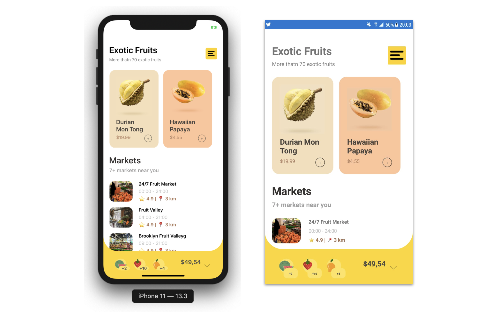

### Platforms

Android, iOS.

### Features:
* CollectionView.
* Layouts.
* [PancakeView](https://github.com/sthewissen/Xamarin.Forms.PancakeView).

### More information:
- Blog: [Replicating Exotic Fruits App in Xamarin Forms](https://askxammy.com/replicating-exotic-fruits-app-in-xamarin-forms/)
- Source code: [https://github.com/LeomarisReyes/ExoticFruitSample](https://github.com/LeomarisReyes/ExoticFruitSample)
- Author: [Leomaris Reyes](https://github.com/LeomarisReyes)

## [XamarinFormsProfilePage](https://github.com/AndreiMisiukevich/XamarinFormsProfilePage)

Xamarin.Forms Profile Page.

### Platforms

Android, iOS.

### Features:
* [CardsView](https://github.com/AndreiMisiukevich/CardView).
* [TouchView](https://github.com/AndreiMisiukevich/TouchEffect).
* [ExpandableView](https://github.com/AndreiMisiukevich/ExpandableView).

### More information:
- Source code: [https://github.com/AndreiMisiukevich/XamarinFormsProfilePage](https://github.com/AndreiMisiukevich/XamarinFormsProfilePage)
- Author: [Andrei Misiukevich](https://twitter.com/andrik_just4fun)

## [PlacesApp](https://github.com/valentineg8/PlacesApp)

Xamarin.Forms travel app UI.

### Platforms

Android, iOS.

### Features:
* Animations.
* CarouselView.
* [PancakeView](https://github.com/sthewissen/Xamarin.Forms.PancakeView).
* [SharedTransitions](https://github.com/GiampaoloGabba/Xamarin.Plugin.SharedTransitions).

### More information:
- Source code: [https://github.com/valentineg8/PlacesApp](https://github.com/valentineg8/PlacesApp)
- Author: [Lorenzo Araujo](https://github.com/valentineg8)

## [ModernDesign](https://github.com/exendahal/ModernDesignXF)

Modern UI using Xamarin Forms.

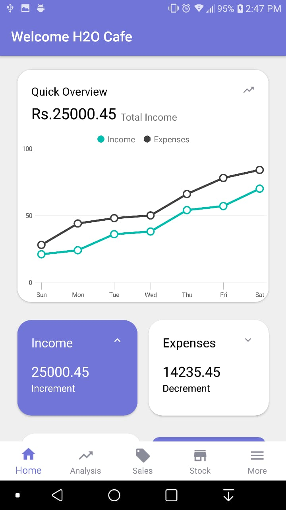

### Platforms

Android, iOS.

### Features:
* Layouts (Frame).
* Shell.
* Syncfusion.Xamarin.SfChart.

### More information:
- Source code: [https://github.com/exendahal/ModernDesignXF](https://github.com/exendahal/ModernDesignXF)
- Author: [Santosh Dahal](https://github.com/exendahal)

## [FashionStore](https://github.com/valentineg8/FashionStore)

Xamarin.Forms Fashion Store UI.

### Platforms

Android, iOS.

### Features:
* Animations.
* BindableLayout.
* CarouselView.
* [PancakeView](https://github.com/sthewissen/Xamarin.Forms.PancakeView).
* [SharedTransitions](https://github.com/GiampaoloGabba/Xamarin.Plugin.SharedTransitions).

### More information:
- Source code: [https://github.com/valentineg8/FashionStore](https://github.com/valentineg8/FashionStore)
- Author: [Lorenzo Araujo](https://github.com/valentineg8)

## [YogaUI](https://github.com/davidortinau/YogaUI)

UI exercise using C# UI, Xplat Images and Fonts, and LiveSharp.

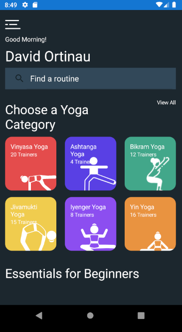

### Platforms

Android, iOS and UWP.

### Features:
* C# UI.
* XPlat Images.
* Xplat Fonts.

### More information:
- Source code: [https://github.com/davidortinau/YogaUI](https://github.com/davidortinau/YogaUI)
- Author: [David Ortinau](https://twitter.com/davidortinau)

## [Chased Home UI Design](https://github.com/ufukhawk/Chased-Home-UI-Design)

Xamarin.Forms goodlooking UI sample.

### Platforms

Android, iOS.

### Features:
* Custom Entry.
* [PancakeView](https://github.com/sthewissen/Xamarin.Forms.PancakeView).

### More information:
- Source code: [https://github.com/ufukhawk/Chased-Home-UI-Design](https://github.com/ufukhawk/Chased-Home-UI-Design)
- Author: [Ufuk Zimmerman](https://github.com/ufukhawk)

## [FlightBookingApp](https://github.com/jsuarezruiz/FlightBookingApp)

Xamarin.Forms goodlooking UI sample using SwipeView to create a custom Pull to Refresh effect.

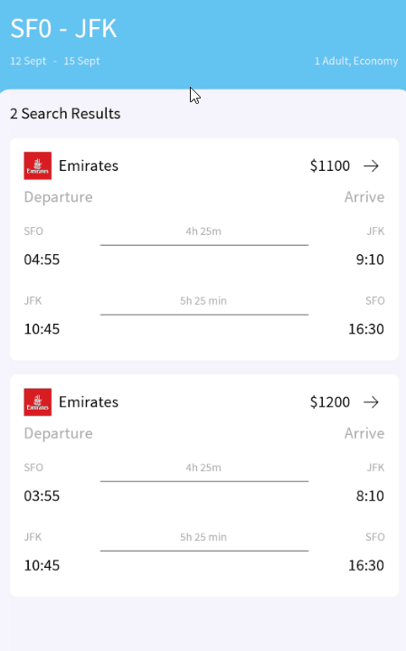

### Platforms

Android, iOS.

### Features:
* CollectionView.
* Lottie.
* SwipeView.

### More information:
- Source code: [https://github.com/jsuarezruiz/FlightBookingApp](https://github.com/jsuarezruiz/FlightBookingApp)
- Author: [Javier Suárez](https://twitter.com/jsuarezruiz)

## [TravelAppSample](https://github.com/LeomarisReyes/TravelAppSample/)

UI replicated in Xamarin Forms.
⚠ Design obteined from Dribble. -> https://dribbble.com/shots/9061096-Travel-App

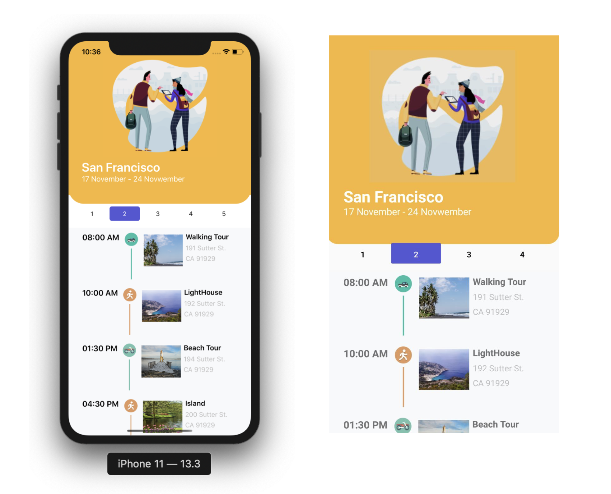

### Platforms

Android, iOS.

### Features:
* CollectionView.
* Layouts.

### More information:
- Blog: [Let’s replicate a Travel App in Xamarin Forms](https://askxammy.com/lets-replicate-a-travel-app-in-xamarin-forms/)
- Source code: [https://github.com/LeomarisReyes/TravelAppSample](https://github.com/LeomarisReyes/TravelAppSample)
- Author: [Leomaris Reyes](https://github.com/LeomarisReyes)

## [XamarinTV](https://github.com/xamarin/app-xamarintv)

Xamarin.Forms app demonstrating the dual-screen device capability for neo and duo devices .

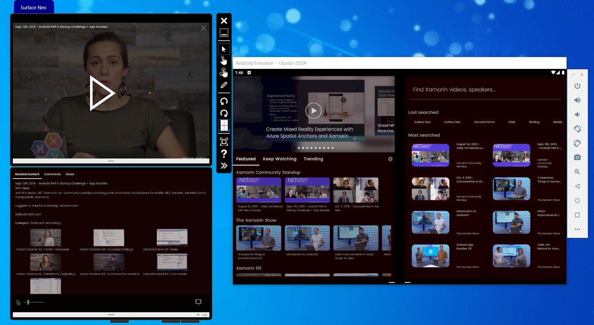

### Platforms

Android, UWP.

### Features:
* BindableLayout.
* CollectionView.
* MediaElement.
* Xamarin.Forms.DualScreen.
* StateTriggers.

### More information:
- Source code: [https://github.com/xamarin/app-xamarintv](https://github.com/xamarin/app-xamarintv)

## [UserProfile UI](https://github.com/LeomarisReyes/UserProfileUISample)

UI replicated in Xamarin Forms. Design obteined from Dribble: https://dribbble.com/shots/9033707-Daily-UI-006-User-Profile

### Platforms

Android, iOS.

### Features:
* Layouts.
* Styles.

### More information:
- Blog: [Replicating User Profile UI in Xamarin.Forms](https://askxammy.com/replicating-user-profile-ui-in-xamarin-forms/)
- Source code: [https://github.com/LeomarisReyes/UserProfileUISample](https://github.com/LeomarisReyes/UserProfileUISample)
- Author: [Leomaris Reyes](https://github.com/LeomarisReyes)
 
## [FoodDeliveryAppDuo](https://github.com/jsuarezruiz/FoodDeliveryAppDuo)

Xamarin.Forms good looking UI sample for Surface Duo.

### Platforms

Android.

### Features:
* CarouselView.
* CollectionView.
* IndicatorView.
* Using Xamarin.Duo SDK.

### More information:
- Source code: [https://github.com/jsuarezruiz/FoodDeliveryAppDuo](https://github.com/jsuarezruiz/FoodDeliveryAppDuo)
- Author: [Javier Suárez](https://twitter.com/jsuarezruiz)

## [Food UI Sample](https://github.com/LeomarisReyes/FoodAppSample)

A Xamarin.Forms sample based on the [dribble designs by Rajat](https://dribbble.com/shots/8970618-Food-App).

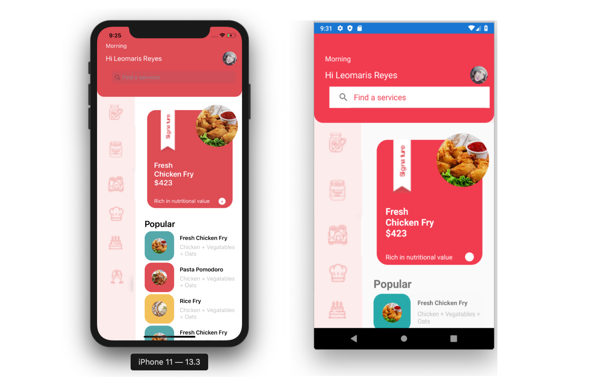

### Platforms

Android, iOS.

### Features:
* CollectionView.
* Styles.
* MVVM.

### More information:
- Blog: [Replicating Food UI Sample](https://askxammy.com/replicating-food-ui-sample/)
- Source code: [https://github.com/LeomarisReyes/FoodAppSample](https://github.com/LeomarisReyes/FoodAppSample)
- Author: [Leomaris Reyes](https://github.com/LeomarisReyes)
 
## [XamCall](https://github.com/ufukhawk/XamCall)

Xamarin.Forms Call Screen UI.

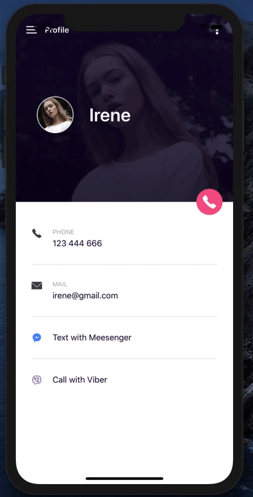

### Platforms

Android, iOS.

### Features:
* Gradients.
* [Shared Transitions](https://github.com/GiampaoloGabba/Xamarin.Plugin.SharedTransitions).
  
### More information:
- Source code: [https://github.com/ufukhawk/XamCall](https://github.com/ufukhawk/XamCall)
- Author: [Ufuk Zimmerman](https://github.com/ufukhawk)

## [XamUIDemo](https://github.com/ufukhawk/XamUIDemo)

Xamarin.Forms Login Screen UI.

### Platforms

Android, iOS.

### Features:
* Dynamic Design.
* Animations.
* Custom controls.
* GradientView.
  
### More information:
- Source code: [https://github.com/ufukhawk/XamUIDemo](https://github.com/ufukhawk/XamUIDemo)
- Author: [Ufuk Zimmerman](https://github.com/ufukhawk)
  
## [Cruise Mobile UI](https://www.andreasnesheim.no/xamarin-ui-challenge-cruise-mobile-ui-part-1/)

A Xamarin.Forms UI Challenge based on the fantastic [dribble designs by Tamo Miqeladze](https://www.behance.net/tamo13).

 

### Features:
* CarouselView.
* Custom Fonts.
* [PancakeView](https://github.com/sthewissen/Xamarin.Forms.PancakeView).
  
### More information:
- Blog: [Xamarin UI Challenge – Cruise Mobile UI](https://www.andreasnesheim.no/xamarin-ui-challenge-cruise-mobile-ui-part-1/)
- Author: [Andreas Nesheim](https://twitter.com/AndreasNesheim)
  
## [FurnitureStore](https://github.com/kphillpotts/FurnitureStore)

A Xamarin.Forms UI Challenge based on the fantastic [dribble designs by UXIS](https://dribbble.com/shots/7126187-IKEA-Store-App).

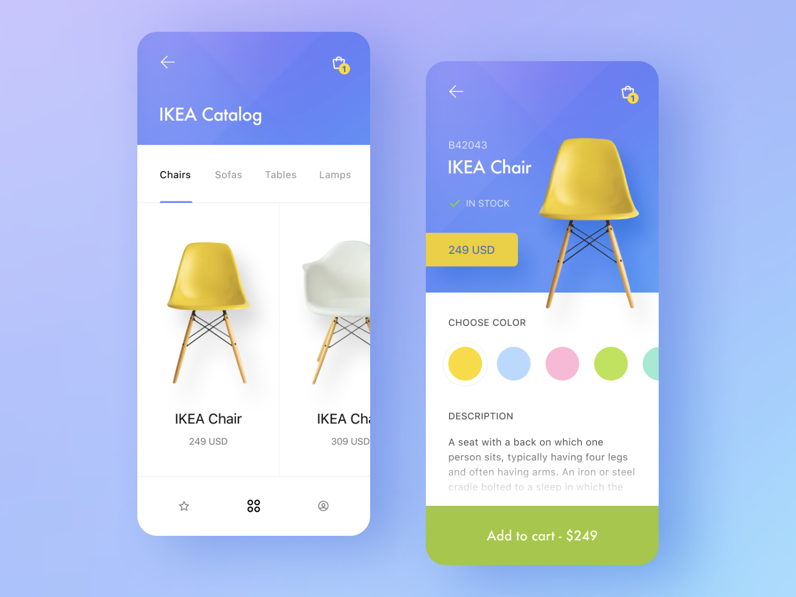

### Features:
* CarouselView.
* [Shared Transitions](https://github.com/GiampaoloGabba/Xamarin.Plugin.SharedTransitions).

### More information:
- Source code: [https://github.com/kphillpotts/FurnitureStore](https://github.com/kphillpotts/FurnitureStore)
- Author: [Kym Phillpotts](https://twitter.com/kphillpotts)

## [MountainTripSample](https://github.com/LeomarisReyes/MountainTripSample)

 Super nice UI inspired by [Mountain Trip Design](https://dribbble.com/shots/8142497-Mountain-trip-time-iOS-app-design).

### Platforms

Android, iOS.

### Features:
* VisualStateManager.
* Layouts.
* Styles.

### More information:
- Blog: [Replicating great UI in Xamarin Forms](https://askxammy.com/replicating-great-ui-in-xamarin-forms/)
- Source code: [https://github.com/LeomarisReyes/MountainTripSample](https://github.com/LeomarisReyes/MountainTripSample)
- Author: [Leomaris Reyes](https://github.com/LeomarisReyes)

## [FavFighters](https://github.com/jsuarezruiz/FavFighters)

Xamarin.Forms goodlooking UI sample using the new SwipeView.

### Platforms

Android, iOS.

### Features:
* CollectionView.
* SwipeView.

### More information:
- Source code: [https://github.com/jsuarezruiz/FavFighters](https://github.com/jsuarezruiz/FavFighters)
- Author: [Javier Suárez](https://twitter.com/jsuarezruiz)

## [FacebookUISample](https://github.com/LeomarisReyes/FaceBookUISample)

Replicate the Facebook profile page with Xamarin.Forms.

 

### Platforms

Android, iOS.

### Features:
* CollectionView.
* Bindable Layouts.
* [PancakeView](https://github.com/sthewissen/Xamarin.Forms.PancakeView).
* FFImageLoading.

### More information:
- Source code: [https://github.com/LeomarisReyes/FaceBookUISample](https://github.com/LeomarisReyes/FaceBookUISample)
- Author: [Leomaris Reyes](https://github.com/LeomarisReyes)

## [FlyMe](https://github.com/davidortinau/FlyMe)

This is a Xamarin.Forms sample app showcasing the use of Material Design and CollectionView within the new Shell container.
Demo presented at Microsoft Ignite 2019.

  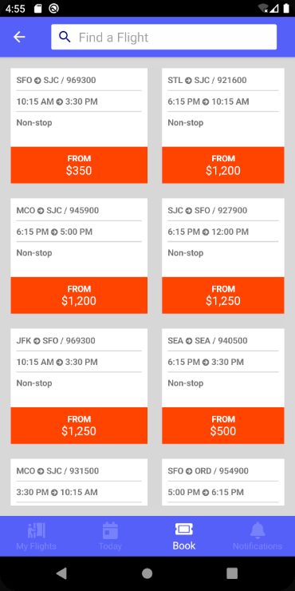

### Platforms

Android, iOS and UWP.

### Features:
* CollectionView.
* Shell.
* Visual.

### More information:
- Source code: [https://github.com/davidortinau/FlyMe](https://github.com/davidortinau/FlyMe)
- Author: [David Ortinau](https://twitter.com/davidortinau)

## [IcelandMoss](https://github.com/kphillpotts/IcelandMoss)

A Xamarin.Forms UI Challenge.

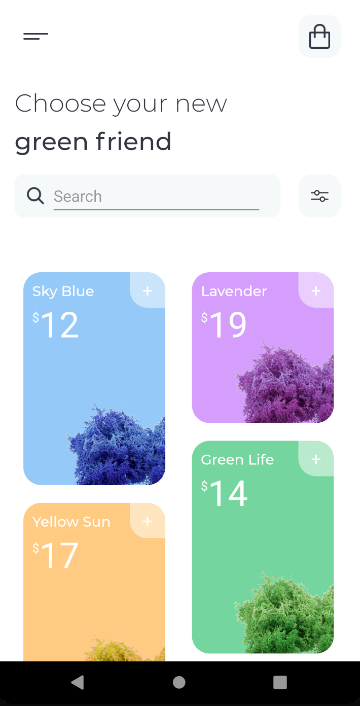

### Platforms

Android, iOS.

### Features:
* Bindable Layout (Staggered list).

### More information:
- Source code: [https://github.com/kphillpotts/IcelandMoss](https://github.com/kphillpotts/IcelandMoss)
- Author: [Kym Phillpotts](https://twitter.com/kphillpotts)
  
## [Credit Card Checkout](https://github.com/egbakou/CreditCardCheckout)

This UI Challenge is based on the fantastic dribble designs by [Antra Sharma](https://dribbble.com/antra03).

### Platforms

Android, iOS.

### Features:
* CardsView.
* [PancakeView](https://github.com/sthewissen/Xamarin.Forms.PancakeView).

### More information:

- Blog: [Xamarin UI Challenge - Credit Card Checkout](https://lioncoding.com/2019/10/11/2019-10-11-xamarin-ui-challenge-credit-card-checkout/)
- Source code: [https://github.com/egbakou/CreditCardCheckout](https://github.com/egbakou/CreditCardCheckout)
- Author: [Kodjo Laurent Egbakou](https://twitter.com/lioncoding)

## [DrinksGalleryApp](https://github.com/jsuarezruiz/DrinksGalleryApp)

Xamarin.Forms goodlooking UI sample using the new CarouselView (Parallax). 

### Platforms

Android, iOS.

### Features:
* Animations.
* CarouselView.
* [PancakeView](https://github.com/sthewissen/Xamarin.Forms.PancakeView) (Corner Radius, Gradients).
* Parallax.

### More information:
- Source code: [https://github.com/jsuarezruiz/DrinksGalleryApp](https://github.com/jsuarezruiz/DrinksGalleryApp)
- Author: [Javier Suárez](https://twitter.com/jsuarezruiz)

## [Pretty Weather](https://github.com/jamesmontemagno/app-pretty-weather)

A very pretty weather application built with Xamarin.Forms.

### Platforms

Android, iOS.

### Features:
* [Xamarin.Essentials](https://github.com/xamarin/Essentials).
* [PancakeView](https://github.com/sthewissen/Xamarin.Forms.PancakeView) (Corner Radius, Gradients).
  
### More information:
- Source code: [https://github.com/jamesmontemagno/app-pretty-weather](https://github.com/jamesmontemagno/app-pretty-weather)
- Author: [James Montemagno](https://twitter.com/jamesmontemagno)

## [TravellingApp](https://github.com/jsuarezruiz/TravellingApp)

Xamarin.Forms goodlooking UI sample using the new **CarouselView**.

### Platforms

Android, iOS.

### Features:
* Animations.
* Xamarin.Forms CarouselView.
* Custom Fonts.
* Lottie.
* Shell.
* Video Player.

### More information:
- Source code: [https://github.com/jsuarezruiz/TravellingApp](https://github.com/jsuarezruiz/TravellingApp)
- Author: [Javier Suárez](https://twitter.com/jsuarezruiz)

## [WeatherApp](https://github.com/devcrux/WeatherApp)

Beautiful WeatherApp UI in Xamarin.Forms.

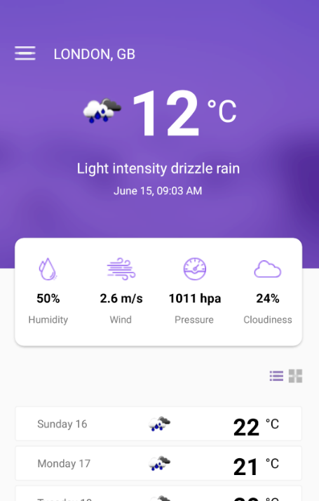

### Platforms

Android, iOS.

### Features
* ImageButton.
* ListView.
* Styles.

### More information:
- Source code: [https://github.com/devcrux/WeatherApp](https://github.com/devcrux/WeatherApp)
- Author: [Oludayo Alli](https://github.com/devcrux)

## [UnZone](https://github.com/kphillpotts/UnZone)

This UI Challenge is based on the fantastic dribble designs by Rick Waalders.

https://dribbble.com/shots/1551934-Unzone-Details-popup-animation

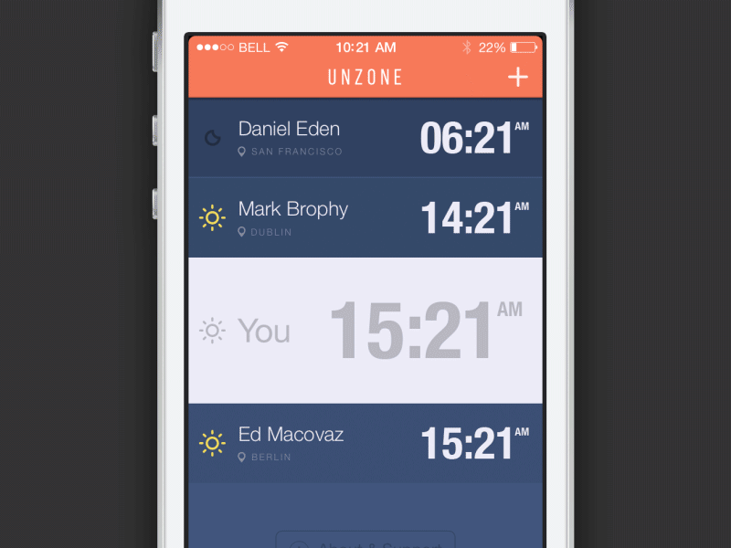

### Platforms

Android, iOS.

### Features
* Animations.
* BindableLayout.

### More information:
- Source code: [https://github.com/kphillpotts/UnZone](https://github.com/kphillpotts/UnZone)
- Author: [Kym Phillpotts](https://twitter.com/kphillpotts)

## [BookSwap](https://github.com/kphillpotts/BookSwap)

This UI Challenge is based on the fantastic dribble designs by [Tubik](https://dribbble.com/Tubik).

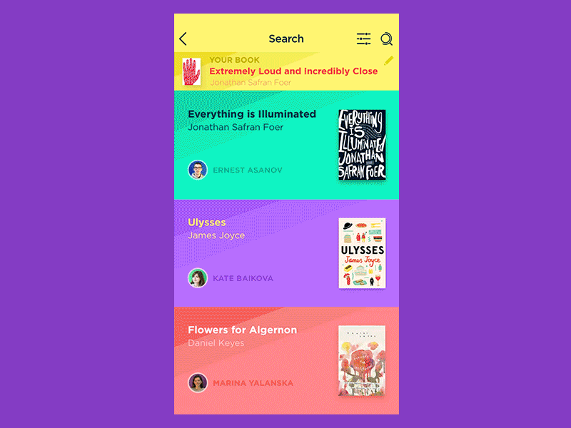

### Platforms

Android, iOS.

### Features
* Animations.
* ListView.
* Custom ViewCell.
* SkiaSharp.

### More information:
- Source code: [https://github.com/kphillpotts/BookSwap](https://github.com/kphillpotts/BookSwap)
- Author: [Kym Phillpotts](https://twitter.com/kphillpotts)

## [FashionApp](https://github.com/devcrux/FashionApp)

Beautiful Fashion App Design Using Xamarin.Forms.

### Platforms

Android, iOS.

### Features
* CollectionView.
* Shell.

### More information:
- Source code: [https://github.com/devcrux/FashionApp](https://github.com/devcrux/FashionApp)
- Author: [Oludayo Alli](https://github.com/devcrux)

## [MarvelCards](https://github.com/kphillpotts/MarvelCards)

A Xamarin.Forms UI Challenge based on https://dribbble.com/shots/5935613-Marvel-Movies-Interaction.

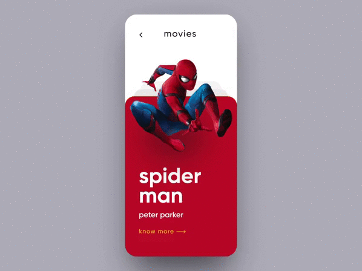

### Platforms

Android, iOS.

### Features
* [CardsView](https://github.com/AndreiMisiukevich/CardView).
* Animations.

### More information:
- Source code: [https://github.com/kphillpotts/MarvelCards](https://github.com/kphillpotts/MarvelCards)
- Author: [Kym Phillpotts](https://twitter.com/kphillpotts)

## [SyncFusion Essential UI Kit for Xamarin.Forms](https://github.com/syncfusion/essential-ui-kit-for-xamarin.forms)

Elegantly designed XAML templates for Xamarin.Forms apps. These templates follow the MVVM design pattern to provide hassle-free integration and are compatible with Android, iOS, and UWP platforms. 

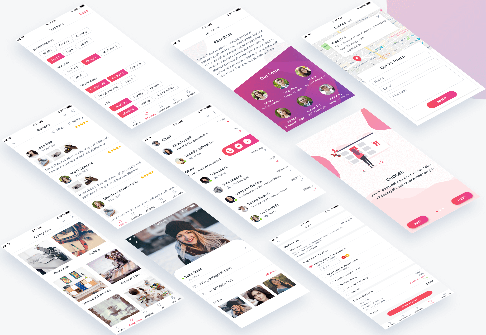

### Platforms

Android, iOS and UWP.

### Features
* Rich, elegant XAML layouts for most common scenarios.
* Layouts optimized for phones, tablets, and desktop.
* Based on the MVVM design pattern to work with any MVVM framework.
* Easy integration.
* Developer-friendly APIs.
* Appearance customization using styles.
* Optimized layouts to get the best possible performance.
* Right-to-left rendering support.

### More information:
- Source code: [https://github.com/syncfusion/essential-ui-kit-for-xamarin.forms](https://github.com/syncfusion/essential-ui-kit-for-xamarin.forms)

## [AirNZClone](https://github.com/rid00z/AirNZClone)

Air NZ app clone using Xamarin.Forms.

### Platforms

Android, iOS.

### Features:
- Animations.
- Carousel.

### More information:
- Source code: [https://github.com/rid00z/AirNZClone](https://github.com/rid00z/AirNZClone)
- Author: [Michael Ridland](https://github.com/rid00z)

## [Balloony](https://github.com/shanranm/Balloony)

Xamarin Forms UI Challenge based on [Ballon Slider Control design](https://dribbble.com/shots/6549207-Balloon-Slider-Control).

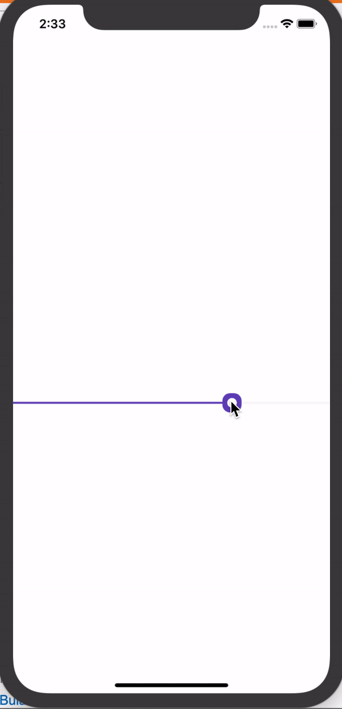

### Platforms

Android, iOS.

### Features:
- SkiaSharp.
- Use Svg (FFImageLoading).
- Gestures.

### More information:
- Source code: [https://github.com/shanranm/Balloony](https://github.com/shanranm/Balloony)
- Author: [Shanmukha Ranganath](https://github.com/shanranm)

## [PlayMusicXamarinClone](https://github.com/AlejandroRuiz/PlayMusicXamarinClone)

Google Play Music app clone using Xamarin.Forms Shell.

 

### Platforms

Android, iOS.

### Features:
- Xamarin.Forms Shell.
- CollectionView.
- SearchHandler.

### More information:
- Blog: [Xamarin.Forms 4 In Action: Rapid Prototyping](https://alejandroruizvarela.blogspot.com/2019/07/xamarinforms-4-in-action-rapid.html)
- Source code: [https://github.com/AlejandroRuiz/PlayMusicXamarinClone](https://github.com/AlejandroRuiz/PlayMusicXamarinClone)
- Author: [Alejandro Ruiz Varela](https://github.com/AlejandroRuiz)

## [FabulousTravel](https://github.com/mallibone/FabulousTravel)

A beautiful Xamarin Forms sample using Atomic Design, F# and Fabulous.

### Platforms

Android, iOS.

### Features:
- Carousel.
- F# UI (using Fabulous).

### More information:
- Blog: [Creating beautiful Xamarin Forms apps using Atomic Design, F# and Fabulous](https://mallibone.com/post/creating-beautiful-xamarin-forms-apps-using-atomic-design-f-and-fabulous)
- Source code: [https://github.com/mallibone/FabulousTravel](https://github.com/mallibone/FabulousTravel)
- Author: [Mark Allibone](https://github.com/mallibone)
  
## [FicusUIChallenge](https://github.com/Pujolsluis/FicusUIChallenge)

Xamarin.Forms UI Challenge Ficus IoT App.

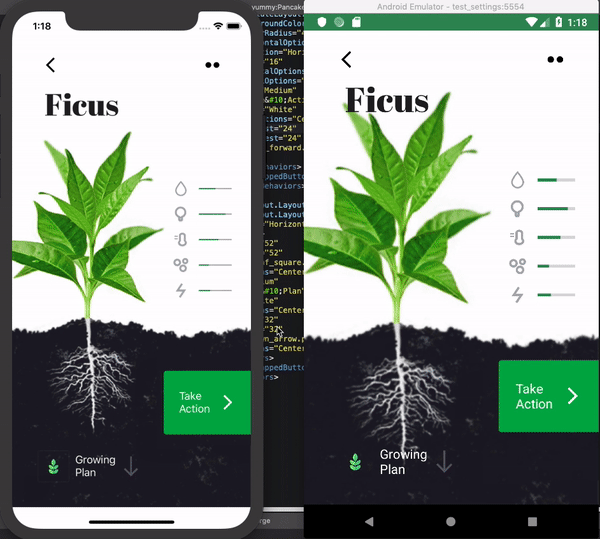

### Platforms

Android, iOS.

### Features:
- Custom ListView.
- Corner Radius.
  
### More information:
- Source code: [https://github.com/Pujolsluis/FicusUIChallenge](https://github.com/Pujolsluis/FicusUIChallenge)
- Author: [Luis Pujols](https://github.com/Pujolsluis)
- 
## [XamBookLibrary](https://github.com/shanranm/XamBookLibrary)

Xamarin.Forms UI challenge from the [design](https://dribbble.com/shots/6603461-Library-App) by Victoria Sgarro.

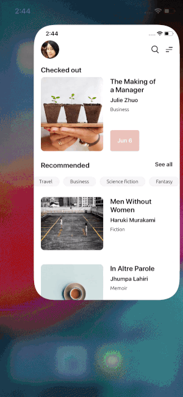

### Platforms

Android, iOS.

### Features:
- Animations.
- Circle Images.
- PancakeView (Corners, etc.).

### More information:
- Source code: [https://github.com/shanranm/XamBookLibrary](https://github.com/shanranm/XamBookLibrary)
- Author: [Shanmukha Ranganath](https://github.com/shanranm)
  
## [Art Plant Mall](https://github.com/jsuarezruiz/Art-Plant-Mall)

A Xamarin.Forms UI challenge from the [design](https://dribbble.com/shots/6612746-Art-Plant-Mall) by [JIANGGM](https://dribbble.com/JIANGGM).

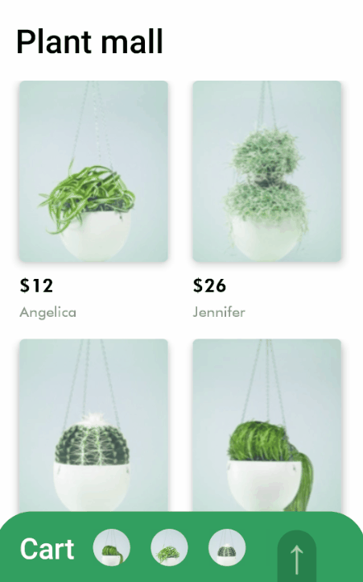 

### Platforms

Android, iOS.

### Features:
- Animations.
- CollectionView.
- VisualStateManager.
- Custom Controls.
- Parallax effect.

### More information:
- Blog: [[Xamarin UI Challenge] Art Plant Mall](https://javiersuarezruiz.wordpress.com/2019/07/17/xamarin-ui-challenge-art-plant-mall-english-version/)
- Source code: [https://github.com/jsuarezruiz/Art-Plant-Mall](https://github.com/jsuarezruiz/Art-Plant-Mall)
- Author: [Javier Suárez](https://twitter.com/jsuarezruiz)
  
## [Run Away!](https://github.com/roubachof/SkiaSharpnado)

The Run Away! app: Drawing gradient lines on top of Maps with SkiaSharp.

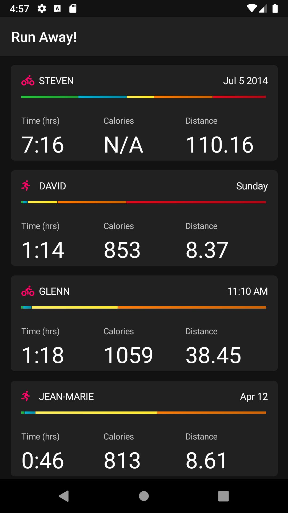 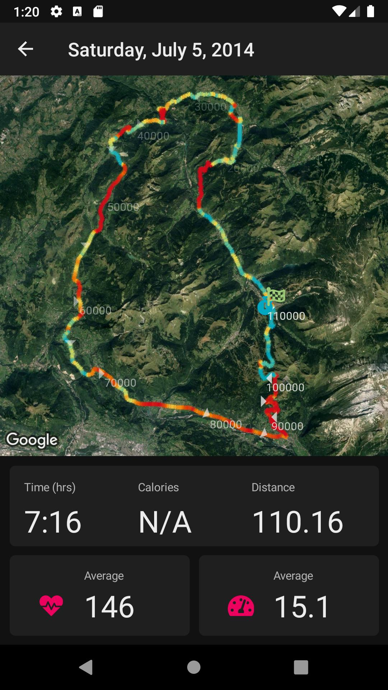 

### Platforms

Android, iOS.

### Features:
- Maps.
- Paths in the map using SkiaSharp.

### More information:
- Blog: [The Run Away! app: Drawing gradient lines on top of Maps with SkiaSharp](https://www.sharpnado.com/run-away-app/)
- Source code: [https://github.com/roubachof/SkiaSharpnado](https://github.com/roubachof/SkiaSharpnado)
- Author: [Jean-Marie Alfonsi](https://github.com/roubachof)

## [RottenUI](https://github.com/kphillpotts/RottenUI)

A Xamarin.Forms UI Challenge.

 

### Platforms

Android, iOS.

### Features:
- SkiaSharp.
- PancakeView.
- Custom tabs.

### More information:
- Source code: [https://github.com/kphillpotts/RottenUI](https://github.com/kphillpotts/RottenUI)
- Author: [Kym Phillpotts](https://twitter.com/kphillpotts)
  
## [Mountain Mobile](https://github.com/kphillpotts/MountainMobile)

A Xamarin.Forms UI Challenge playing with SkiaSharp and animations.

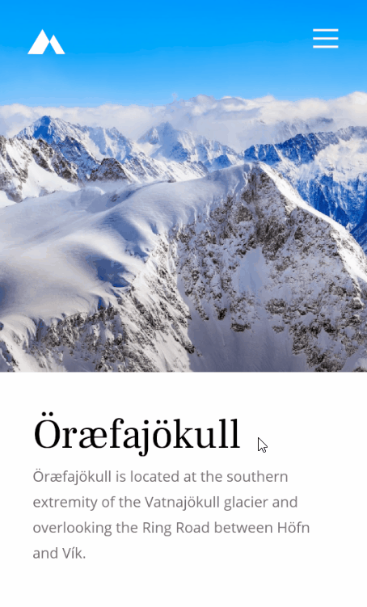 

### Platforms

Android, iOS.

### Features:
- SkiaSharp.
- Animations.

### More information:
- Source code: [https://github.com/kphillpotts/MountainMobile](https://github.com/kphillpotts/MountainMobile)
- Author: [Kym Phillpotts](https://twitter.com/kphillpotts)

## [Payment UI Sample](https://github.com/CrossGeeks/PaymentUISample)

A beautiful credit card payment UI, inspired by the following UI from [CVTemplates](https://cvtemplates.club/002-credit-card-checkout-screen-2x/).

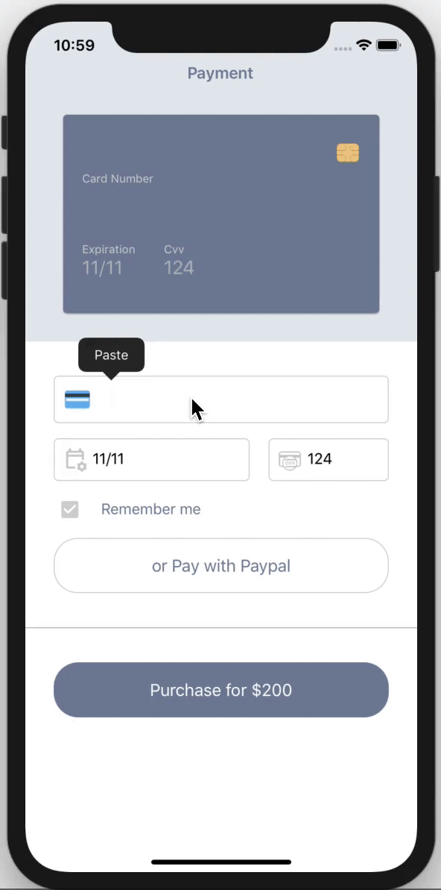 

### Platforms

Android, iOS.

### Features:
- Visual.
- Behaviors.

### More information:
- Blog: [Credit Card Payment UI in Xamarin Forms](https://xamgirl.com/credit-card-payment-ui-in-xamarin-forms/)
- Source code: [https://github.com/CrossGeeks/PaymentUISample](https://github.com/CrossGeeks/PaymentUISample)
- Author: [Charlin Agramonte](https://xamgirl.com)
  
## [xUber](https://github.com/CrossGeeks/xUber)

Uber Clone using Xamarin.Forms.

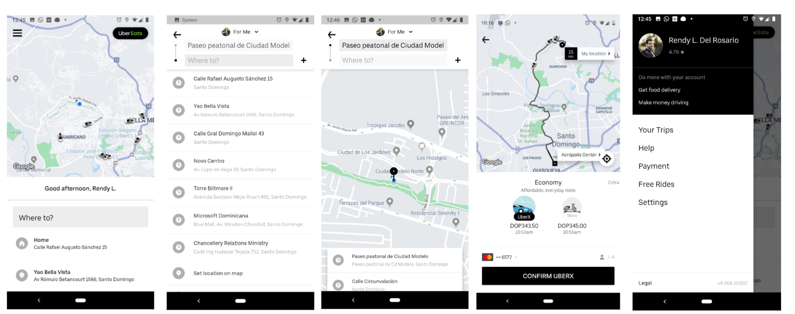 

### Platforms

Android, iOS.

### Features:
- [Google Maps](https://github.com/amay077/Xamarin.Forms.GoogleMaps).
- [Cards](https://github.com/AndreiMisiukevich/CardView).
- Dialogs.

### More information:
- Blog: [Introducing xUber – Uber clone using Xamarin Forms](https://www.xamboy.com/2019/07/03/introducing-xuber-uber-clone-using-xamarin-forms/)
- Source code: [https://github.com/CrossGeeks/xUber](https://github.com/CrossGeeks/xUber)
- Author: [Rendy del Rosario](https://github.com/CrossGeeks)

## [KickassUI.Banking](https://github.com/sthewissen/KickassUI.Banking)

A Xamarin.Forms version of a banking app concept, showing off how to use a base page.

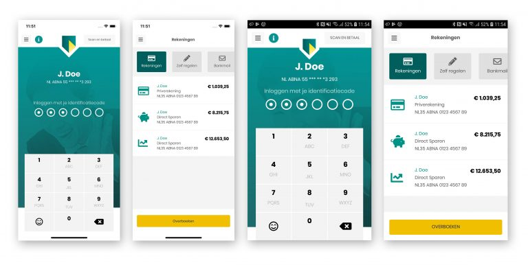 

### Platforms

Android, iOS.

### Features:
- BasePage.
- Xamarin Essentials.
- PancakeView.

### More information:
- Blog: [Create a kickass banking app using a BasePage in Xamarin](https://www.thewissen.io/create-a-kickass-banking-app-using-a-basepage-in-xamarin/)
- Source code: [https://github.com/sthewissen/KickassUI.Banking](https://github.com/sthewissen/KickassUI.Banking)
- Author: [Steven Thewissen](https://twitter.com/devnl)

## [YellowClone](https://github.com/ionixjunior/YellowClone)

A Yellow App clone made with Xamarin.Forms. 

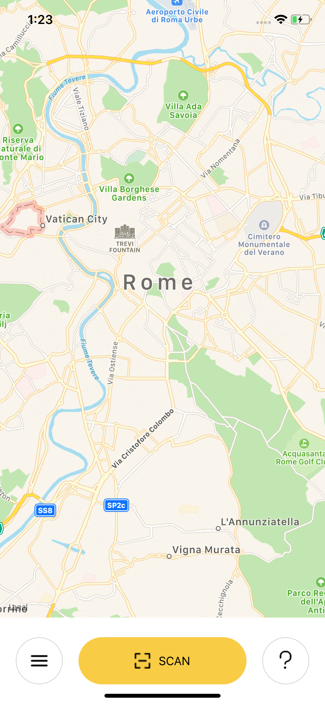 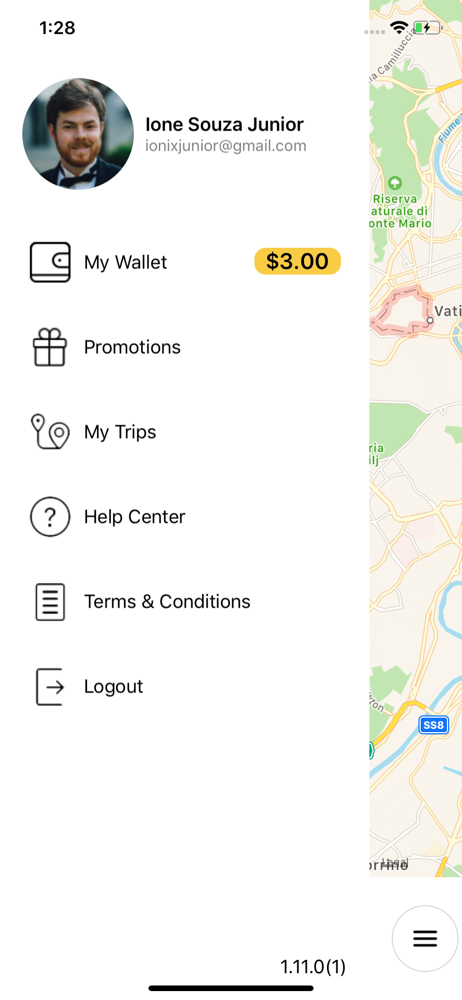 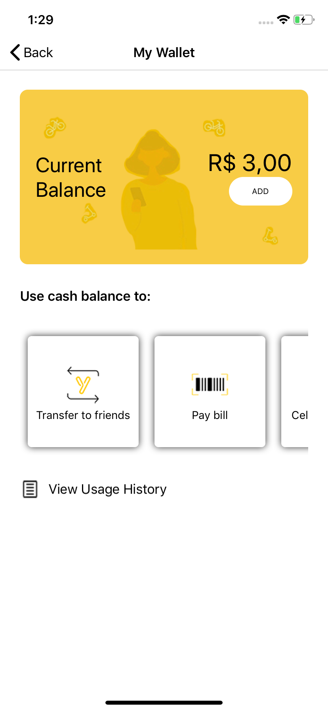

### Platforms

Android, iOS.

### Features:

- Custom Map.
- MasterDetailPage.

### More information:
- Source code: [https://github.com/ionixjunior/YellowClone](https://github.com/ionixjunior/YellowClone)
- Author: [Ione Souza Junior](https://github.com/ionixjunior)

## [Xamarin CloudMusic](https://github.com/o1298098/Xamarin-CloudMusic)

A Xamarin.Forms version of the NeteaseCloudMusic app.

### Platforms

Android, iOS.

### Features:

- Animations.
- Audio Visualizer.
- Blur Effect.
- Parallax Effect.
- Translucent StatusBar.
- Video Player.
- Xamarin.Forms Shell.

### More information:
- Source code: [https://github.com/o1298098/Xamarin-CloudMusic](https://github.com/o1298098/Xamarin-CloudMusic)
- Author: [o1298098](https://github.com/o1298098)
  
## [DayVsNight](https://github.com/kphillpotts/DayVsNight)

A Xamarin.Forms UI Challenge.

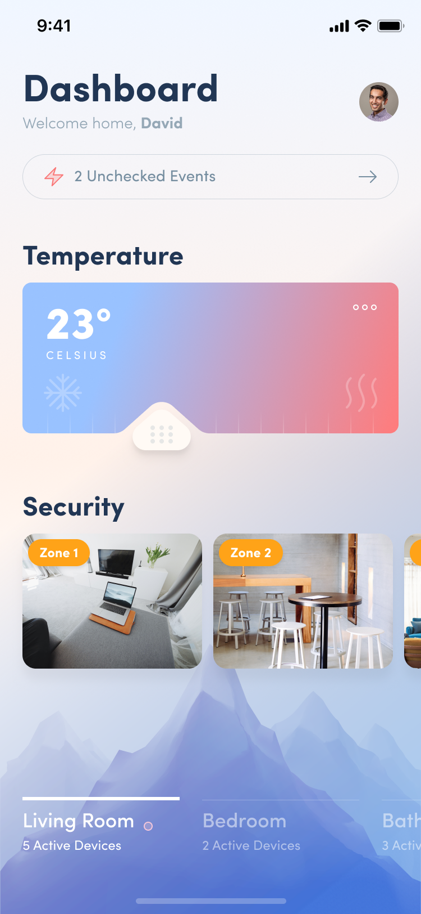

### Platforms

Android, iOS.

### Features:

- SkiaSharp controls.
- PancakeView.

### More information:
- Source code: [https://github.com/kphillpotts/DayVsNight](https://github.com/kphillpotts/DayVsNight)
- Author: [Kym Phillpotts](https://twitter.com/kphillpotts)

## [WhatsAppUI](https://github.com/egbakou/WhatsAppUI)

WhatsApp UI in Xamarin.Forms.

### Platforms

Android, iOS.

### Features:

- Custom Floating Action Button.
- Use of Emoji.
- Use of the camera.

### More information:

- Source code: [https://github.com/egbakou/WhatsAppUI](https://github.com/egbakou/WhatsAppUI)
- Author: [Kodjo Laurent Egbakou](https://twitter.com/lioncoding)

## [EMI Calculator by Syncfusion](https://github.com/syncfusion/xamarin-showcase-emi-calculator)

The EMI (Equated Monthly Instalment) Calculator is an application developed using Xamarin.Forms and Syncfusion controls to calculate the EMI with the given details of principal amount, tenure, and interest.

### Platform
Android, iOS.

### Features:
* XAML UI
* Converters
* Custom controls
* Data binding
* Behaviours
* MVVM
* Xamarin.Essentials 
* Localization
* Styles
* AutoFac for dependency injection
* Phone and tablet layout

### More information:

Source code: https://github.com/syncfusion/xamarin-showcase-emi-calculator

This project uses the following Syncfusion controls:

* [SfNumericUpDown](https://www.syncfusion.com/xamarin-ui-controls/numericupdown)
* [SfChart](https://www.syncfusion.com/xamarin-ui-controls/charts)
* [SfDataGrid](https://www.syncfusion.com/xamarin-ui-controls/datagrid)
* [SfTabView](https://www.syncfusion.com/xamarin-ui-controls/tabbed-view)
* [XlsIO](https://www.syncfusion.com/excel-framework/xamarin)
* [SfButton](https://www.syncfusion.com/xamarin-ui-controls/button)

## [Timeline With Images](https://github.com/egbakou/Timeline)

Awesome UI: Timeline with images in Xamarin.Forms.

### Platforms

Android, iOS.

### Features:

- ListView to Timeline.
- Custom ViewCell.

### More information:

- Source code: [https://github.com/egbakou/Timeline](https://github.com/egbakou/Timeline)
- Author: [Kodjo Laurent Egbakou](https://twitter.com/lioncoding)

## [ArtNews](https://github.com/jsuarezruiz/ArtNews)

Xamarin.Forms good looking UI sample. This sample is based on [Art News App](https://dribbble.com/shots/6282441-Art-News-App) designed by [Shirley Yao](https://dribbble.com/shirleyyao).

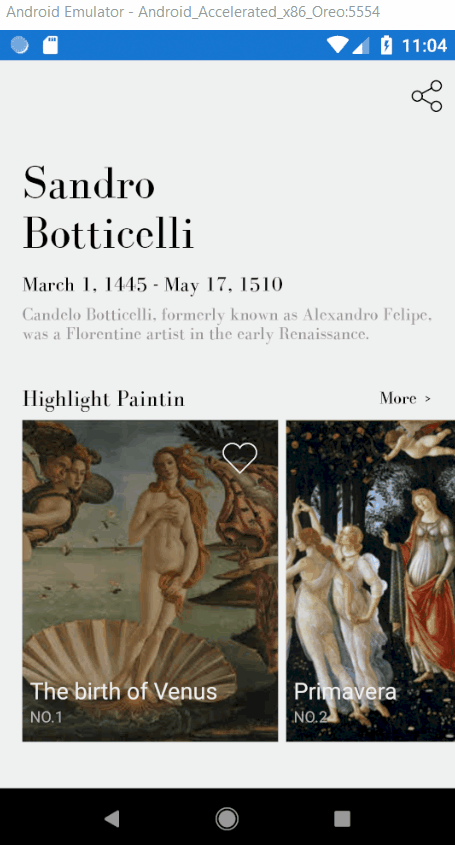

### Platforms
Android, iOS.

### Features:
- XAML Animations.
- BindableLayout.
- CollectionView
- Page transitions.
- Shared element transitions. 

### More information:
- Source code: [https://github.com/jsuarezruiz/ArtNews](https://github.com/jsuarezruiz/ArtNews)
- Author: [Javier Suárez](https://twitter.com/jsuarezruiz)

## [ArtAuction](https://github.com/kphillpotts/ArtAuction)

A Xamarin.Forms Layout challenge. From the design found at: https://dribbble.com/shots/6177235-Valuable-Auction-Product-Page by [Alex Pesenka](https://dribbble.com/alex_pesenka).

### Platforms
Android, iOS, UWP.

### Features:
- Animations.
- BindableLayout.

### More information:
- Blog: [Xamarin.Forms UI Challenges - Art Auction](https://kymphillpotts.com/xamarin-forms-ui-challenge-artauction.html)
- Source code: [https://github.com/kphillpotts/ArtAuction](https://github.com/kphillpotts/ArtAuction)
- Author: [Kym Phillpotts](https://twitter.com/kphillpotts)

## [TimelinePulse](https://github.com/jsuarezruiz/TimelinePulse)

Xamarin.Forms good looking UI sample. This sample is based on [Timeline Profile Screen](https://dribbble.com/shots/1980532-Timeline-Profile) designed by [Anton Aheichanka](https://dribbble.com/madebyanton).

### Platforms
Android, iOS.

### Features:
- SkiaSharp.

### More information:
- Source code: [https://github.com/jsuarezruiz/TimelinePulse](https://github.com/jsuarezruiz/TimelinePulse)
- Author: [Javier Suárez](https://twitter.com/jsuarezruiz)

## [KickassUI.Traveler](https://github.com/sthewissen/KickassUI.Traveler)

A Xamarin.Forms version of the Traveler app to prove you can create good-looking UI with Xamarin.Forms.

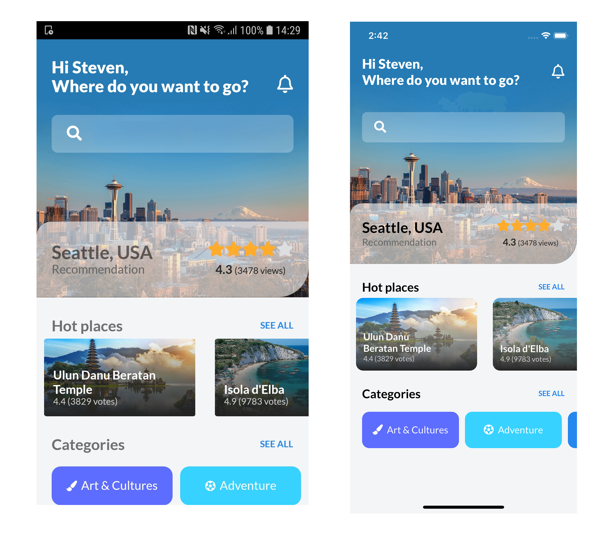

### Platforms
Android, iOS.

### Features:
- CollectionView.
- [PancakeView](https://github.com/sthewissen/Xamarin.Forms.PancakeView).

### More information:
- Blog: [Travel broadens the mind…](https://www.thewissen.io/travel-broadens-the-mind/)
- Source code: [https://github.com/sthewissen/KickassUI.Traveler](https://github.com/sthewissen/KickassUI.Traveler)
- Author: [Steven Thewissen](https://twitter.com/devnl)

## [AnimatedHighlightApp](https://github.com/andreinitescu/AnimatedHighlightApp)

A Xamarin.Forms application with form highlight animation using SkiaSharp and Xamarin.Forms built-in animations.

### Platforms
Android, iOS.

### Features:
- SkiaSharp.

### More information:
- [Blog: Xamarin.Forms + SkiaSharp: Create Awesome Cross-Platform Animations in Your Mobile App](https://www.telerik.com/blogs/xamarinforms-skiasharp-create-awesome-cross-platform-animations-in-your-mobile-app)
- Source code: https://github.com/andreinitescu/AnimatedHighlightApp
- Author: [Andrei Nitescu](https://github.com/andreinitescu)

## [My Tasks](https://github.com/jsuarezruiz/MyTasks)

A Xamarin.Forms version of the [Filter Menu](https://dribbble.com/shots/1956586-Filter-Menu) design by Anton Aheichanka to prove you can create **goodlooking UI** with Xamarin.Forms.

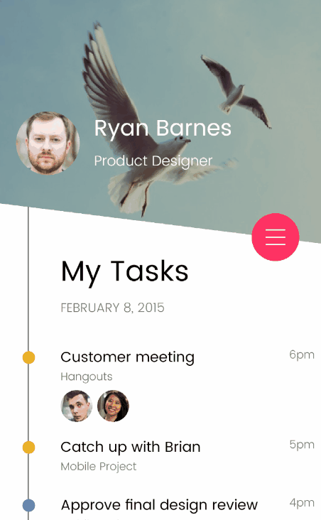

### Platforms
Android, iOS.

### Features:
- Xamarin.Forms Animations.
- SkiaSharp.

### More information:
- Blog: [[Xamarin.Forms Challenge] My Tasks](https://javiersuarezruiz.wordpress.com/2019/02/28/xamarin-forms-challenge-my-tasks/)
- Source code: https://github.com/jsuarezruiz/MyTasks
- Author: [Javier Suárez](https://twitter.com/jsuarezruiz)

## [KickassUI.Chameleon](https://github.com/sthewissen/KickassUI.Chameleon)

A Xamarin.Forms version of the Chameleon app to prove you can create goodlooking UI with Xamarin.Forms.

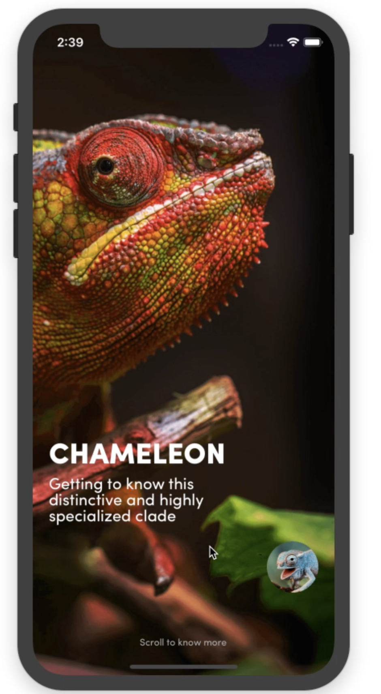

### Platforms

Android, iOS.

### Features:
- Xamarin Essentials.
- Lottie.

### More information:
- Blog: [Creating an encyclopedia page in Xamarin.Forms](https://www.thewissen.io/creating-an-encyclopedia-page-in-xamarin-forms/)
- Source code: https://github.com/sthewissen/KickassUI.Chameleon
- Author: [Steven Thewissen](https://twitter.com/devnl)

## [BindableLayoutPlayground](https://github.com/jsuarezruiz/BindableLayoutPlayground)

A Xamarin.Forms sample to show how to use Bindable Layout. This sample is based on [User Profile Screen](https://dribbble.com/shots/4148230-User-Profile-Screen-Weather-App) designed by [Hernan Vionnet](https://dribbble.com/hernanvionnet).

### Platforms

Android, iOS & UWP.

### Features:
- Xamarin.Forms BindableLayout.
- CSS.

### More information:
- Source code: [https://github.com/jsuarezruiz/BindableLayoutPlayground](https://github.com/jsuarezruiz/BindableLayoutPlayground)
- Author: [Javier Suárez](https://twitter.com/jsuarezruiz)

## [Tailwind Traders](https://github.com/Microsoft/TailwindTraders-Mobile)

 A fictitious retail company showcasing the future of intelligent mobile application experiences.

### Platforms

Android & iOS.

### Features:
- Xamarin.Forms Shell.
- SkiaSharp.

### More information:
- Source code: [https://github.com/Microsoft/TailwindTraders-Mobile](https://github.com/Microsoft/TailwindTraders-Mobile)

## [Posy](https://github.com/sthewissen/Posy) 

A simple but good looking Xamarin.Forms UI screen.

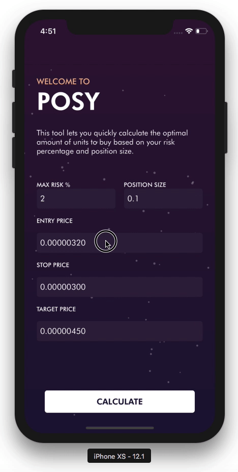

### Platforms

Android & iOS.

### Features:
- Gradient background on the content page.
- A randomly generated set of stars that rotates independently.
- A small card with the result of your calculations.
- A beautiful moon, also rotating independently.
- Some entry animation of controls.

### More information:
- Blog: [Xamarin.Forms in Space!](https://www.thewissen.io/xamarin-forms-in-space/)
- Source code: [https://github.com/sthewissen/Posy](https://github.com/sthewissen/Posy)
- Author: [Steven Thewissen](https://twitter.com/devnl)

## [KickassUI.ParallaxCarousel](https://github.com/sthewissen/KickassUI.ParallaxCarousel)

A Xamarin.Forms Carousel using a nice parallax effect.

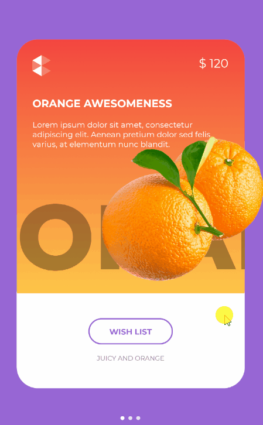

### Platforms

Android & iOS.

### Features:

- Xamarin.Forms 3.2
- Caroulel
- Parallax
- Gradient Color animation

### More information:
- Source code: [https://github.com/sthewissen/KickassUI.ParallaxCarousel](https://github.com/sthewissen/KickassUI.ParallaxCarousel)
- Author: [Steven Thewissen](https://twitter.com/devnl)

## [PulseMusic](https://github.com/jsuarezruiz/PulseMusic)

A Xamarin.Forms music player sample. 

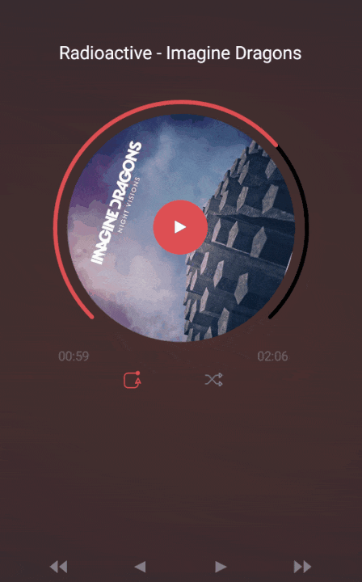

### Platforms

Android & iOS.

### Features:

- Xamarin.Forms 3.1
- SkiaSharp
- Animations

### More information:

- Source code: [https://github.com/jsuarezruiz/PulseMusic](https://github.com/jsuarezruiz/PulseMusic)
- Author: [Javier Suárez](https://twitter.com/jsuarezruiz)

[Martin Finkel](https://github.com/mfkl) has created a version of the application with real player using [libvlcsharp](https://code.videolan.org/mfkl/libvlcsharp-samples/tree/master/PulseMusic).

## [Restaurant-App](https://github.com/Jurabek/Restaurant-App)

Restaurant App is a sample open source application, powered by ASP.NET Core 2.1 and Xamarin.Forms 3.0. It incorporates material design and provides us with an overview of how to build mobile and web applications with a clean architecture and write testable and clean code.

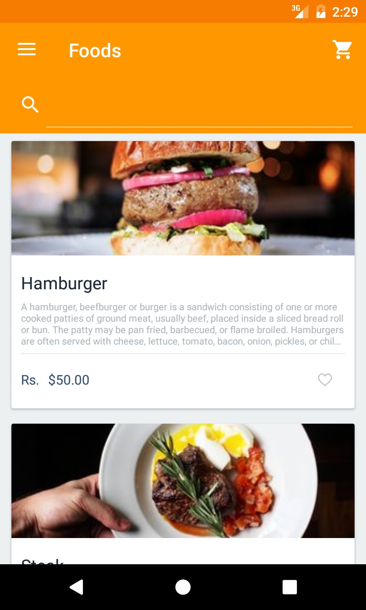 

### Platforms

Android, iOS & UWP for client app.
ASP.NET Core 2.1 for server API.

### Features:

- Xamarin.Forms 3.1

### More information:

- Source code: [https://github.com/Jurabek/Restaurant-App](https://github.com/Jurabek/Restaurant-App)
- Author: [Jurabek Azizkhujaev](https://twitter.com/jazizkhujaev)

## [My Trip Countdown](https://github.com/jsuarezruiz/MyTripCountdown)

A Xamarin.Forms timer until your next vacation. 

### Platforms

Android & iOS.

### Features:

- Xamarin.Forms 3.1
- SkiaSharp

### More information:

- Source code: [https://github.com/jsuarezruiz/MyTripCountdown](https://github.com/jsuarezruiz/MyTripCountdown)
- Author: [Javier Suárez](https://twitter.com/jsuarezruiz)

## [ConferenceVision](https://github.com/Microsoft/ConferenceVision)

Sample Xamarin.Forms 3.0 Phone App showed in Microsoft Build 2018. Use your camera during a conference to capture your experience. Let Vision do the heavy lifting of identifying known products and scan your images to text for easier searching.

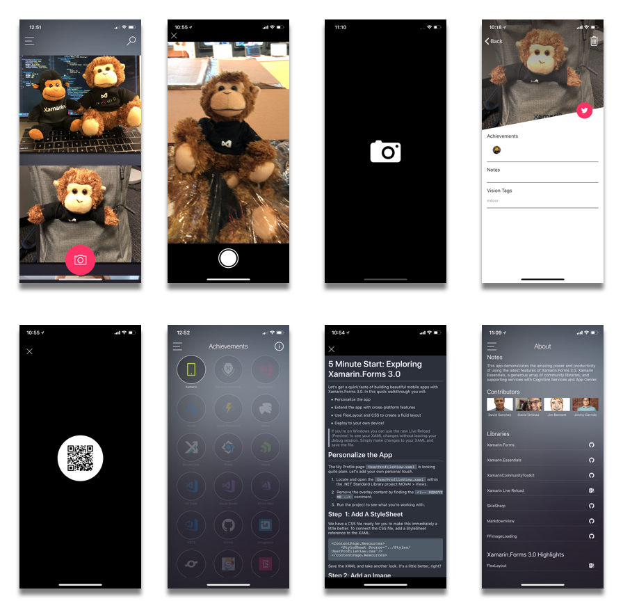

### Platforms

Android, iOS & UWP.

### Features:

- Xamarin.Forms 3.0
- FlexLayout
- CSS
- VisualStateManager
- Custom Vision
- Computer Vision API

### More information:

- Source code: [https://github.com/Microsoft/ConferenceVision](https://github.com/Microsoft/ConferenceVision)

## [SmartHotel](https://github.com/Microsoft/SmartHotel360-mobile-desktop-apps)

Travelers are always on the go, so SmartHotel360 offers a beautiful fully-native cross-device mobile app for guests and business travelers built with Xamarin.

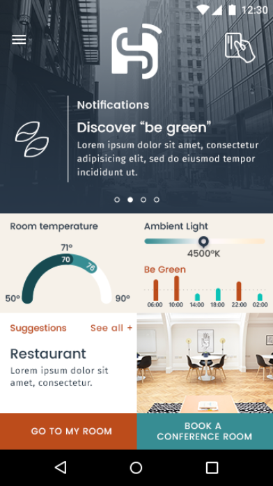 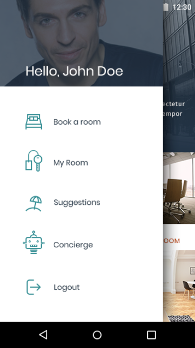 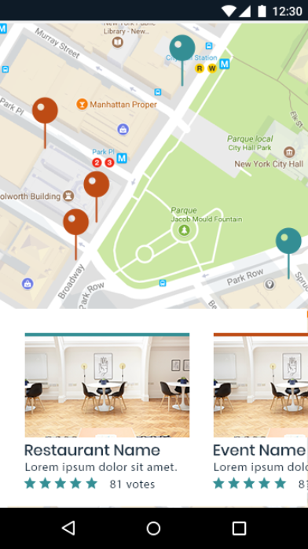 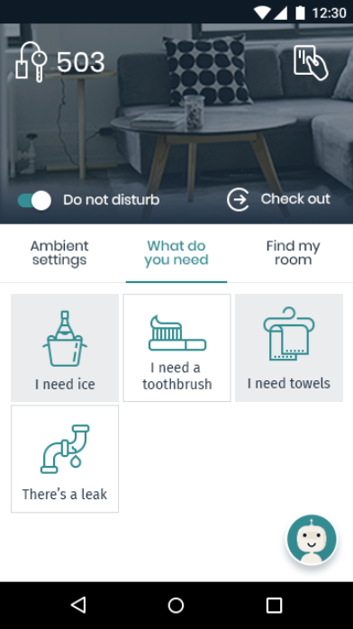

### Platforms

Android, iOS & UWP.

### Features:

- Custom animations from XAML.
- Custom Map.
- SkiaSharp Charts.
- Xamarin.Forms Native Forms.
- Live Player.
- NFC.

### More information:

- Source code:  [https://github.com/Microsoft/SmartHotel360-mobile-desktop-apps](https://github.com/Microsoft/SmartHotel360-mobile-desktop-apps)

## [BikeSharing](https://github.com/Microsoft/BikeSharing360_MobileApps)

BikeSharing360 is a fictitious example of a smart bike sharing system with 10,000 bikes distributed in 650 stations located throughout New York City and Seattle. Their vision is to provide a modern and personalized experience to riders and to run their business with intelligence. Was a demo in the Connect(); 2016.

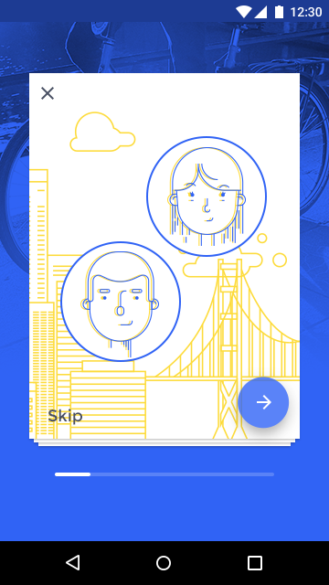 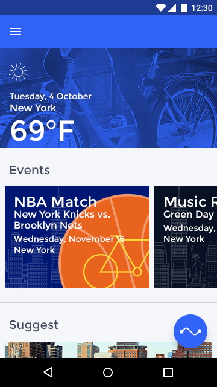  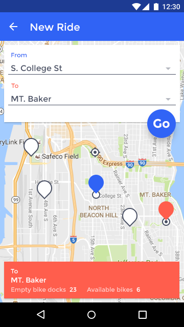

### Platforms

Android, iOS & UWP.

### Features:

- Custom animations from XAML.
- Custom Map.

### More information:

- Source code:  [https://github.com/Microsoft/BikeSharing360_MobileApps](https://github.com/Microsoft/BikeSharing360_MobileApps)

## [Bikr](https://github.com/aloisdeniel/Microcharts.Samples)

A bike activity App. Sample to show Microcharts usage.

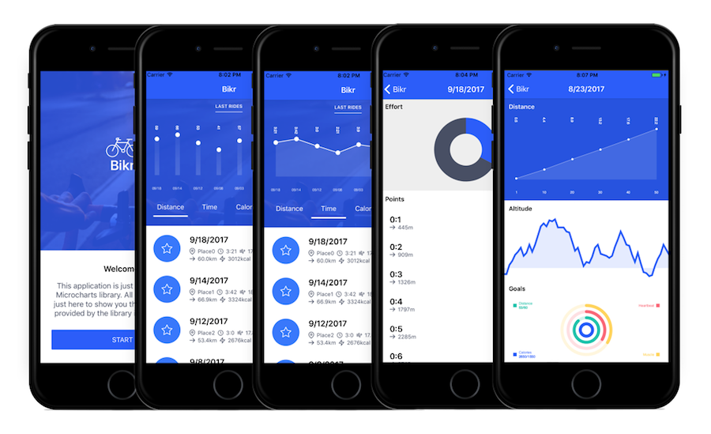

### Platforms

Android, iOS & UWP.

### Features:

- SkiaSharp charts.

### More information:

- Source code: [https://github.com/aloisdeniel/Microcharts.Samples](https://github.com/aloisdeniel/Microcharts.Samples)
- Author: [Aloïs Deniel](https://github.com/aloisdeniel)

## [Evolve](https://github.com/xamarinhq/app-evolve) 

Xamarin Evolve 2016 Mobile App. 

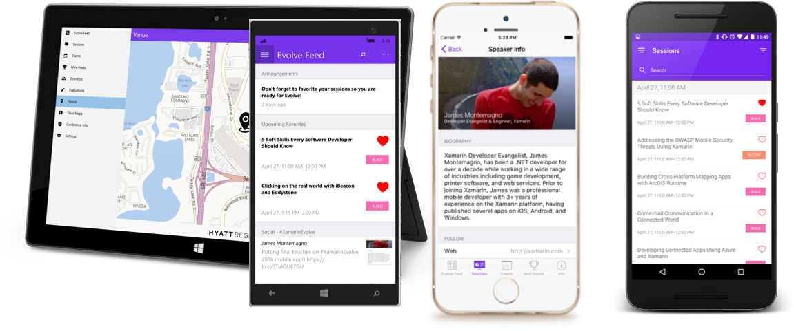

This app is around 15,000 lines of code. The iOS version contains 93% shared code, the Android version contains 90% shared code, the UWP has 99% shared code, and our Azure backend contains 23% shared code with the clients!

### Platforms

Android, iOS & UWP.

### Features:

- Azure + Online/Offline Sync
- Barcode Scanning
- Calendar Integration
- Maps & Navigation
- Push Notifications
- Phone Dialer
- Wi-Fi configuration
- URL Navigation (Universal Links + Google App Indexing)

### More information:

- Source code: [https://github.com/xamarinhq/app-evolve](https://github.com/xamarinhq/app-evolve)
- Authors: [James Montemagno](https://github.com/jamesmontemagno) & [Pierce Boggan](https://github.com/pierceboggan)

## [GreatPlaces](https://github.com/kphillpotts/XamarinFormsLayoutChallenges)

ListView with transparent background and a purple gradient behind.

### Platforms

Android, iOS & UWP.

### Features:

- Custom ViewCells.

### More information:

- Blog: [Xamarin.Forms Layout Challenges – Great Places](https://www.kymphillpotts.com/xamarin-forms-layout-challenges-great-places/)
- Source code: [https://github.com/kphillpotts/XamarinFormsLayoutChallenges](https://github.com/kphillpotts/XamarinFormsLayoutChallenges)
- Author: [Kym Phillpotts](https://twitter.com/kphillpotts)

## [InAnger](https://github.com/awolf/Xamarin-Forms-InAnger)

Samples to show that Xamarin.Forms is capable of creating something that  looks really good.

### Platforms

Android & iOS.

### Samples

- Find a Vet
- Phoenix Peaks
- Jobbberr
- Woofer
- HeatMap
- Hot Sauce
- Findr
- MallDash

### More information:

- Source code: [https://github.com/awolf/Xamarin-Forms-InAnger](https://github.com/awolf/Xamarin-Forms-InAnger)
- Author: [Adam J Wolf](https://twitter.com/adamjwolf)

## [Instagram](https://github.com/adamped/Instagram)

  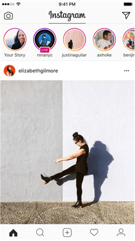  

### Platforms

Android, iOS & UWP.

### Features:

- Custom Entry.
- [Circle Images](https://github.com/jamesmontemagno/ImageCirclePlugin).

### More information:

- Blog: [Creating The Instagram UI In Xamarin.Forms](https://xamarinhelp.com/creating-instagram-ui-xamarin-forms/)
- Source code: [https://github.com/adamped/Instagram](https://github.com/adamped/Instagram)
- Author: [Adam Pedley](https://twitter.com/adpedley)

## [Social Media](https://github.com/kphillpotts/XamarinFormsLayoutChallenges)

This sample show how to recreate a beautifull Social Network profile type page in Xamarin.Forms.

### Features:

- Curved header Image.
- Profile Image that overlaps the header.

### More information:

- Blog: [Xamarin.Forms Layout Challenges – Social Network App](https://www.kymphillpotts.com/social-network-app-layout-design-in-xamarin-forms/)
- Source code: [https://github.com/kphillpotts/XamarinFormsLayoutChallenges](https://github.com/kphillpotts/XamarinFormsLayoutChallenges)
- Author: [Kym Phillpotts](https://twitter.com/kphillpotts)

## [KickassUI.FancyTutorial](https://github.com/sthewissen/KickassUI.FancyTutorial)

A simple (but beautiful) Xamarin.Forms tutorial screen.

### Platforms

Android & iOS.

### Features

- [Carousel](https://github.com/alexrainman/CarouselView)

### More information:

- Blog: [Creating a simple but good-looking app tutorial](https://www.thewissen.io/simple-good-looking-app-tutorial/)
- Source code: [https://github.com/sthewissen/KickassUI.FancyTutorial](https://github.com/sthewissen/KickassUI.FancyTutorial)
- Author: [Steven Thewissen](https://twitter.com/devnl)

## [KickassUI.Runkeeper](https://github.com/sthewissen/KickassUI.Runkeeper)

A Xamarin.Forms version of the Runkeeper App.

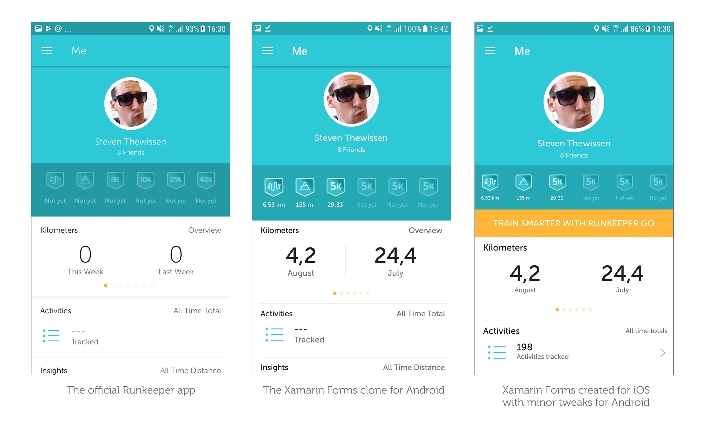

### Platforms

Android & iOS.

### Features:

- Custom Tabs.
- Custom fonts in the page header.
- Custom logo in page header.
- [Carousel](https://github.com/alexrainman/CarouselView).
- Custom Map.

### More information:

- Blog: [Creating a good-looking Xamarin Forms UI: Runkeeper](https://www.thewissen.io/xamarin-forms-ui-runkeeper/)
- Source code: [https://github.com/sthewissen/KickassUI.Runkeeper](https://github.com/sthewissen/KickassUI.Runkeeper)
- Author: [Steven Thewissen](https://twitter.com/devnl)

## [KickassUI.Spotify](https://github.com/sthewissen/KickassUI.Spotify)

A Xamarin.Forms version of the Spotify App.

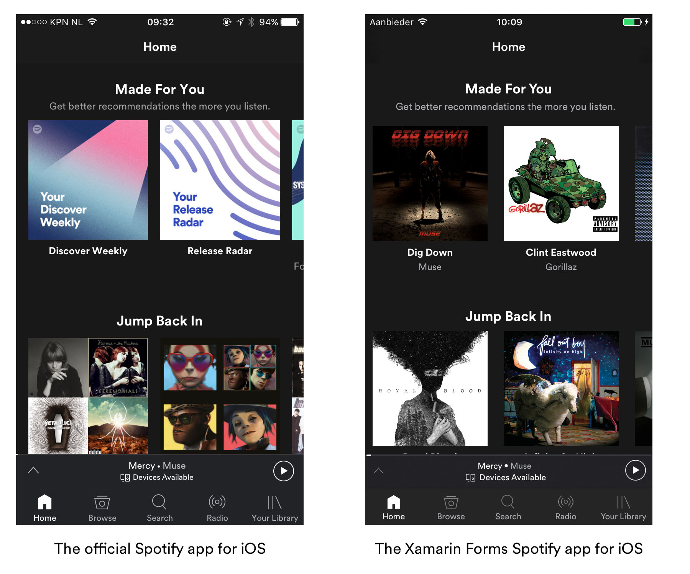
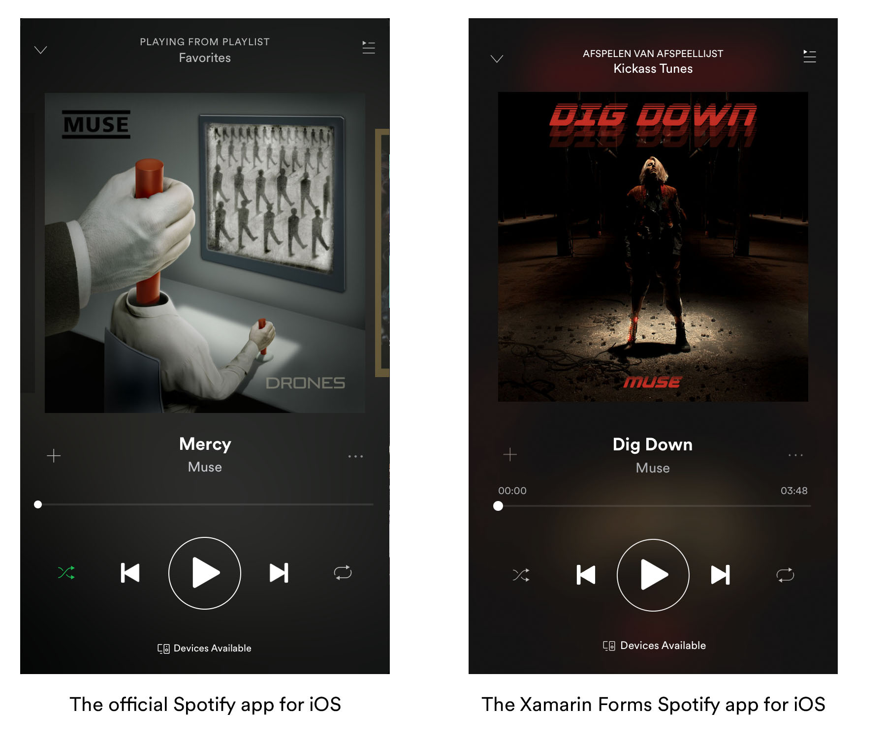

### Platforms

Android & iOS.

### Features:

- Translucent navigation bar.
- Blurred fullscreen background.
- Custom Slider.

### More information:

- Blog: [Creating a good-looking Xamarin Forms UI: Spotify](https://www.thewissen.io/xamarin-forms-ui-spotify/)
- Source code: [https://github.com/sthewissen/KickassUI.Spotify](https://github.com/sthewissen/KickassUI.Spotify)
- Author: [Steven Thewissen](https://twitter.com/devnl)

## [KickassUI.Twitter](https://github.com/sthewissen/KickassUI.Twitter)

A Xamarin.Forms version of the Twitter App.

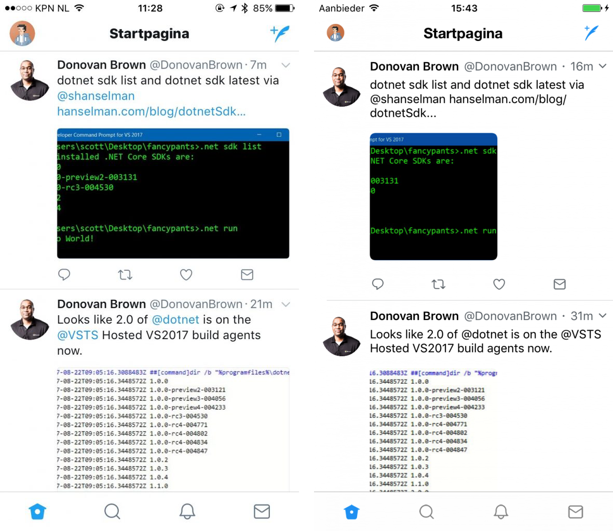

### Platforms

Android & iOS.

### Features:

- Android floating action button.
- MasterDetailPage custom icon.
- Custom Tabs (colors).

### More information:

- Blog: [Creating a good-looking Xamarin Forms UI: Twitter](https://www.thewissen.io/xamarin-forms-ui-twitter/)
- Source code: [https://github.com/sthewissen/KickassUI.Twitter](https://github.com/sthewissen/KickassUI.Twitter)
- Author: [Steven Thewissen](https://twitter.com/devnl)

## [Timeline](https://github.com/kphillpotts/XamarinFormsLayoutChallenges)

A timeline of activities.  This is useful for things like transportation schedules or class times. 

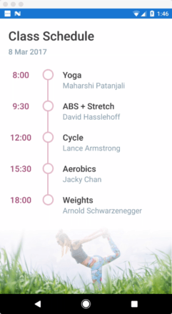 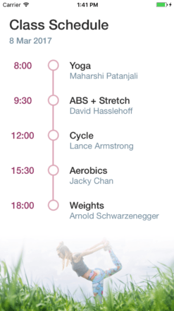 

### Platforms

Android, iOS & UWP.

### Features:

- ListView Header and Footer.
- Custom ViewCell.

### More information:

- Blog: [Xamarin.Forms Layout Challenges – Timeline](https://www.kymphillpotts.com/xamarin-forms-layout-challenges-timeline/)
- Source code: [https://github.com/kphillpotts/XamarinFormsLayoutChallenges](https://github.com/kphillpotts/XamarinFormsLayoutChallenges)
- Author: [Kym Phillpotts](https://twitter.com/kphillpotts)

## [Xamarin.Netflix](https://github.com/jsuarezruiz/xamarin-forms-netflix-sample)

A Xamarin.Forms version of the Netflix App.

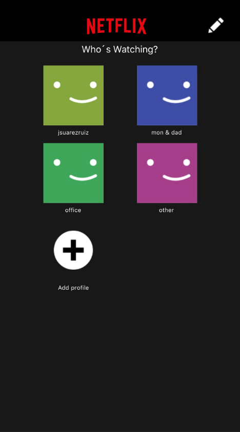 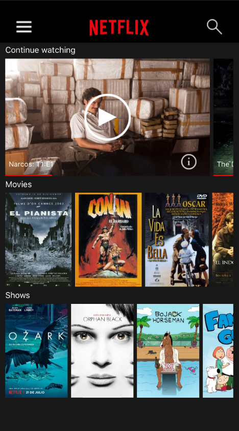 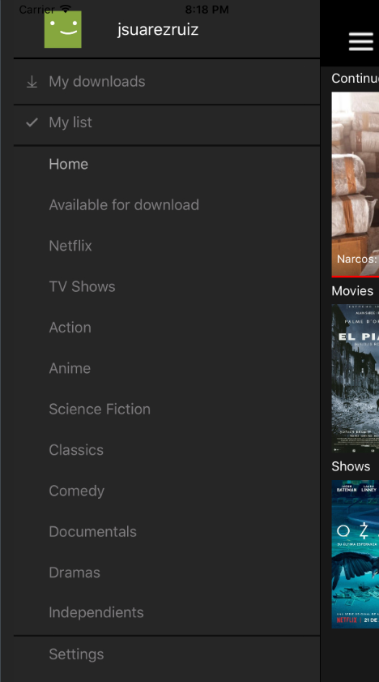 

### Platforms

Android & iOS.

### Features:

- Horizontal List.
- Transparent NavigationBar on Android and iOS.
- Parallax effect.
- [Multi-column List](https://github.com/daniel-luberda/DLToolkit.Forms.Controls/tree/master/FlowListView).

### More information:

- Blog: [Creando la interfaz de Netflix con Xamarin.Forms](https://javiersuarezruiz.wordpress.com/2017/09/18/creando-la-interfaz-de-netflix-con-xamarin-forms/)
- Source code: [https://github.com/jsuarezruiz/xamarin-forms-netflix-sample](https://github.com/jsuarezruiz/xamarin-forms-netflix-sample)
- Author: [Javier Suárez](https://twitter.com/jsuarezruiz)

## [Facebook](https://github.com/XAM-Consulting/FacebookForms)

A Xamarin.Forms version of the Facebook App.

  

### Platforms

Android, iOS & UWP.

### Features:

- Right Slide Bar.
- Disappearing NavigationBar.
- Like Animations.

### More information:

- Blog: [Beautiful Xamarin – Facebook Clone in Xamarin.Forms](http://www.michaelridland.com/mobile/beautiful-xamarin-facebook-clone-in-xamarin-forms/)
- Source code: [https://github.com/XAM-Consulting/FacebookForms](https://github.com/XAM-Consulting/FacebookForms)
- Author: [Michael Ridland](https://twitter.com/rid00z)

## [Movies](https://github.com/jsuarezruiz/xamarin-forms-gtk-movies-sample)

Movies is a Xamarin.Forms GTK backend application that makes use of The Movie Database (TMDb) API to demonstrate the possibilities of the new backend making use of a great variety of functionality.

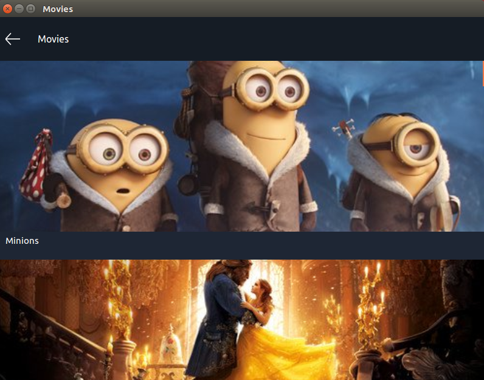 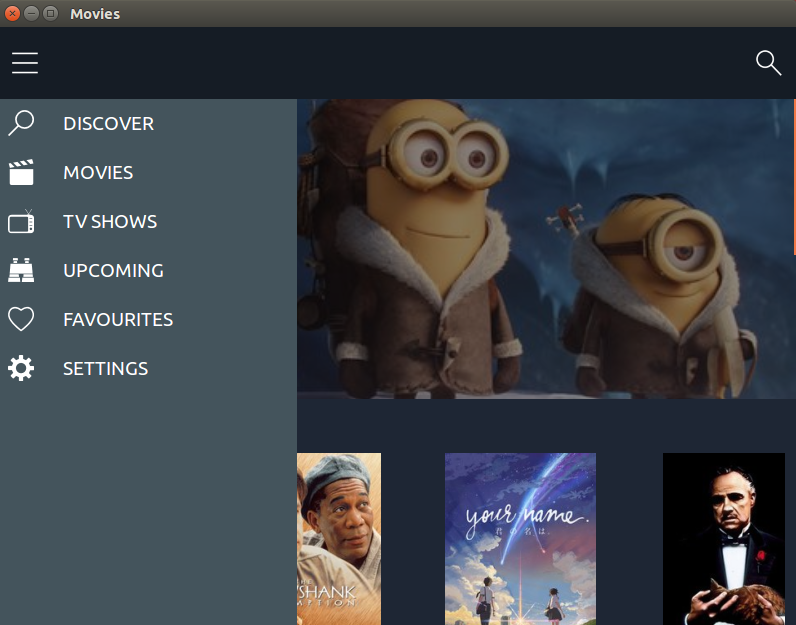 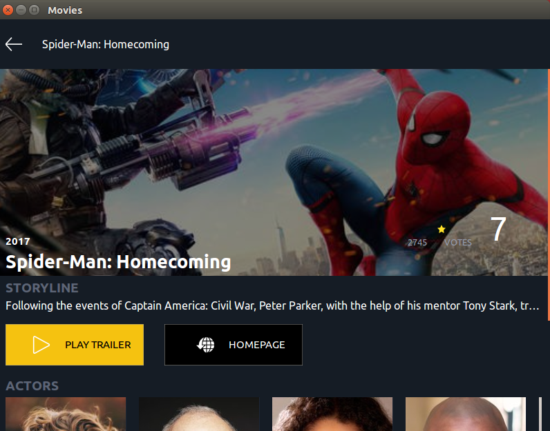 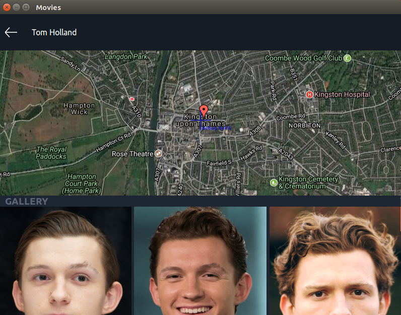

### Platforms

Android, iOS, Linux (GTK), macOS, UWP and Windows (WPF).

### Features:

- MasterDetailPage.
- Maps.
- Gtk Themes.
- Desktop Apps for Linux, macOS and Windows.

### More information:

- Source code: [https://github.com/jsuarezruiz/xamarin-forms-gtk-movies-sample](https://github.com/jsuarezruiz/xamarin-forms-gtk-movies-sample)
- Author: [Javier Suárez](https://twitter.com/jsuarezruiz)

## [WalkthroughApp](https://github.com/jsuarezruiz/xamarin-forms-walkthrough)

WalkthroughApp is a Xamarin.Forms application that makes use of CarouselView and Lottie, to demonstrate the possibilities of creating a fluid and powerful Walkthrough without requiring Custom Renderers.

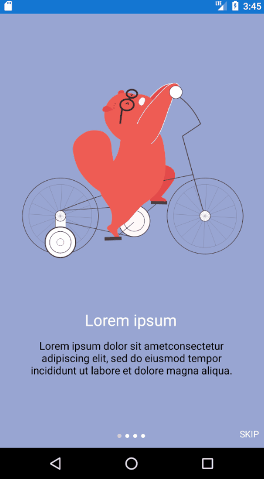 

### Platforms

Android, iOS.

### Features:

- CarouselView
- Lottie
- Animations

### More information:

- Source code: [https://github.com/jsuarezruiz/xamarin-forms-walkthrough](https://github.com/jsuarezruiz/xamarin-forms-walkthrough)
- Author: [Javier Suárez](https://twitter.com/jsuarezruiz)

## [Xamarin Weather App](https://github.com/gheorghedarle/Xamarin-WeatherApp)

Weather App is a simple weather app developed using Xamarin Forms. The app allows you to see the weather from your current location or another location around the globe using OpenWeather Api. Using One Call API the app displays the current weather, 24 hours and 6 days forecast. You can add new locations and switch between them from the Locations screen. From Settings screen you can change the unit system from metric to imperial. The app is available in light mode and dark mode.

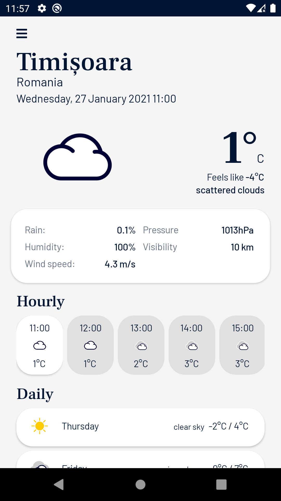 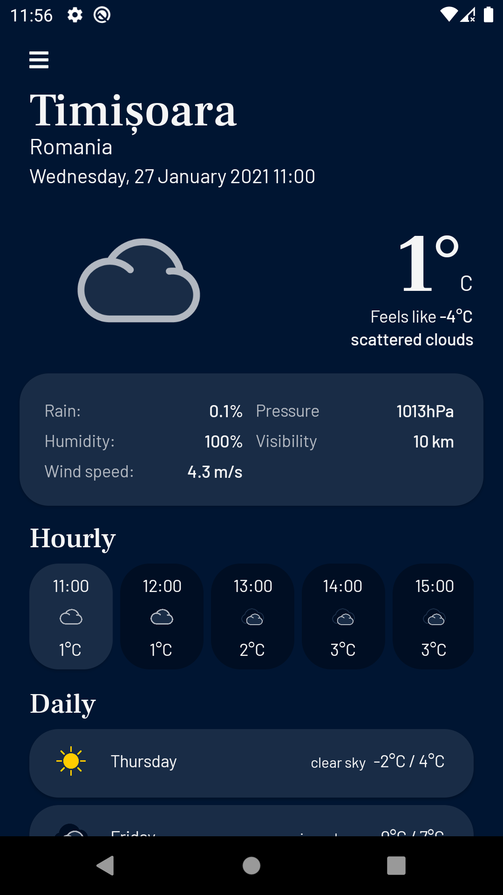 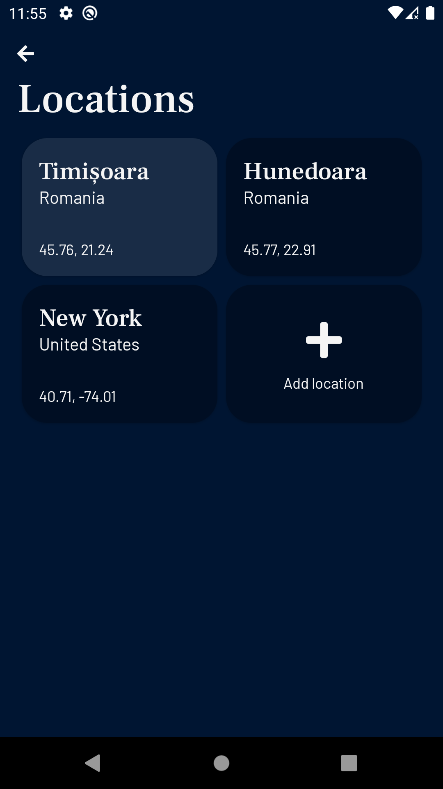

### Platforms

Android, iOS.

### Features

- Xamarin Forms 5.0
- Xamarin Essentials (Location, Placemark, Internet Connection)
- Xamarin CommunityToolkit (SideMenu, StateLayout, TouchEffect, Expander)
- Prism.Forms (MVVM, Dialogs)
- Fody
- Xamarin.Plugin.SharedTransitions (Page Transitions)

### More information:

- Source code: [https://github.com/gheorghedarle/Xamarin-WeatherApp](https://github.com/gheorghedarle/Xamarin-WeatherApp)
- Author: [Darle Gheorghe](https://github.com/gheorghedarle)